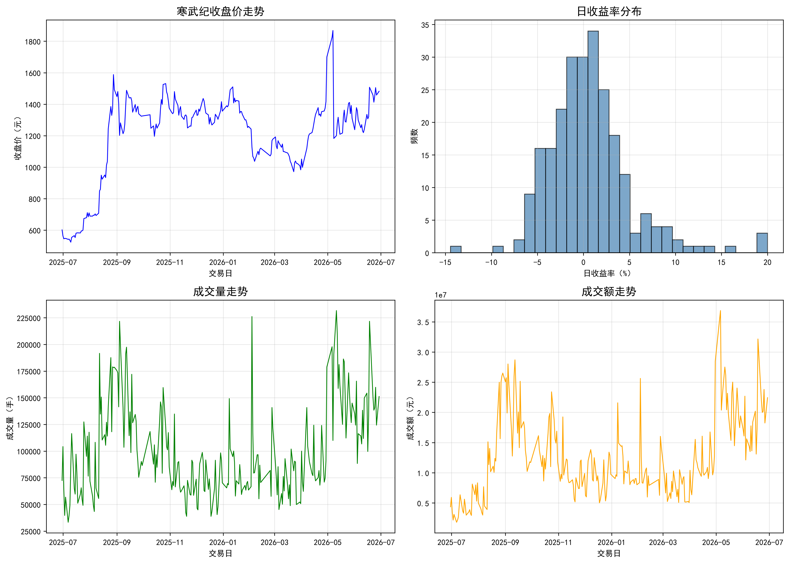
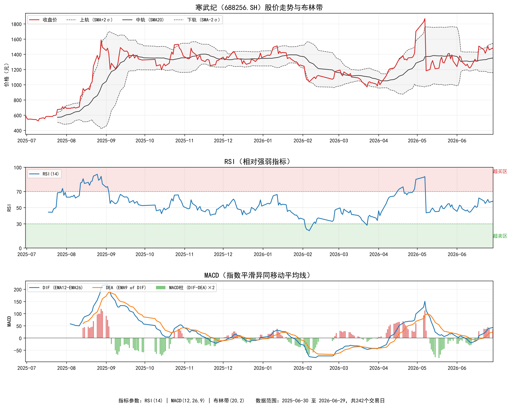
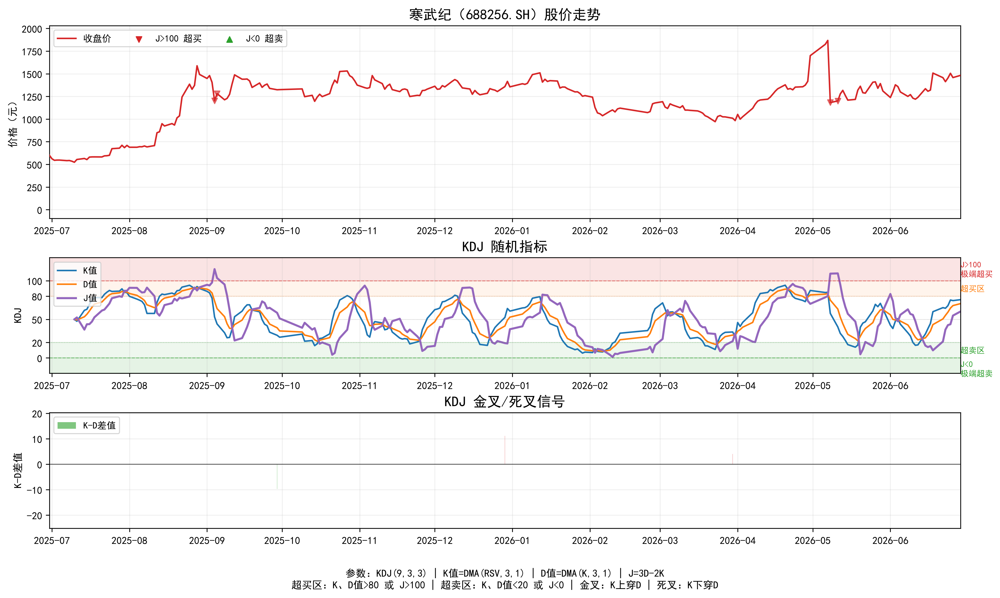

# TASK2：寒武纪（688256.SH）量化交易策略分析

## 任务一：数据诊断分析

### 1.1 数据基础信息

本次分析所使用的数据为寒武纪（股票代码：688256.SH）过去一年的日线行情数据，时间跨度为2025年6月30日至2026年6月29日，共计242个交易日。数据集包含11个字段，分别为ts_code、trade_date、open、high、low、close、pre_close、change、pct_chg、vol与amount。经检查，数据集中不存在重复记录，各字段均无缺失值，数据完整性满足后续分析要求。

### 1.2 缺失值检查结果

表1呈现了各字段的缺失值数量及其占总体样本的比例。结果显示，所有字段的缺失值数量均为0，缺失比例均为0%，表明数据质量良好，可直接用于描述性统计与后续指标构建。

| 字段 | 缺失值数量 | 缺失比例（%） |
|:----|--------:|----------:|
| ts_code | 0 | 0.00 |
| trade_date | 0 | 0.00 |
| open | 0 | 0.00 |
| high | 0 | 0.00 |
| low | 0 | 0.00 |
| close | 0 | 0.00 |
| pre_close | 0 | 0.00 |
| change | 0 | 0.00 |
| pct_chg | 0 | 0.00 |
| vol | 0 | 0.00 |
| amount | 0 | 0.00 |

### 1.3 描述性统计分析

#### 1.3.1 原始字段描述性统计

表2报告了原始价格与成交量字段的描述性统计结果。统计量包括样本量、均值、标准差、方差、最小值、四分位数、最大值、偏度与峰度。由表2可知，寒武纪收盘价均值为1201.22元，标准差为269.67元，价格区间介于523.50元至1868.00元之间，极差为1344.50元，表明研究期间内股价波动幅度较大。日收益率（pct_chg）均值为0.6504%，标准差为4.5671%，偏度为1.2015，峰度为3.8433，呈现出明显的右偏特征与尖峰厚尾特征，提示极端正收益事件出现频率较高。

| 字段 | 样本量 | 均值 | 标准差 | 方差 | 最小值 | 25%分位数 | 50%分位数 | 75%分位数 | 最大值 | 偏度 | 峰度 |
|:----|------:|----:|----:|----:|----:|----:|----:|----:|----:|----:|----:|
| open | 242 | 1192.71 | 268.29 | 71979.20 | 523.00 | 1089.13 | 1291.35 | 1365.00 | 1824.94 | -1.1490 | 0.6418 |
| high | 242 | 1234.70 | 279.47 | 78101.50 | 537.87 | 1120.30 | 1326.61 | 1409.18 | 1966.00 | -1.0896 | 0.7251 |
| low | 242 | 1164.79 | 258.73 | 66938.70 | 520.67 | 1069.11 | 1259.00 | 1332.75 | 1792.80 | -1.1558 | 0.6991 |
| close | 242 | 1201.22 | 269.67 | 72719.00 | 523.50 | 1091.50 | 1288.95 | 1371.33 | 1868.00 | -1.0940 | 0.7007 |
| pre_close | 242 | 1194.97 | 268.50 | 72091.90 | 523.50 | 1087.59 | 1285.38 | 1368.16 | 1825.00 | -1.1572 | 0.6040 |
| change | 242 | 6.2472 | 55.4895 | 3079.08 | -203.00 | -25.005 | 2.455 | 31.5675 | 283.33 | 0.9970 | 4.1793 |
| pct_chg | 242 | 0.6504 | 4.5671 | 20.858 | -14.4484 | -2.1346 | 0.2932 | 2.6528 | 20.0003 | 1.2015 | 3.8433 |
| vol | 242 | 99936.20 | 43107.10 | 1.86×10⁹ | 33310.60 | 66756.90 | 90106.70 | 126178.00 | 231722.00 | 0.8903 | 0.1889 |
| amount | 242 | 1.23×10⁷ | 6.61×10⁶ | 4.37×10¹³ | 1.81×10⁶ | 8.02×10⁶ | 1.04×10⁷ | 1.61×10⁷ | 3.69×10⁷ | 0.8760 | 0.3867 |

#### 1.3.2 派生指标描述性统计

为深入刻画日内价格波动特征，本文进一步构建了日内绝对振幅、日内振幅百分比与日收益率三个派生指标。其中，日内绝对振幅为最高价与最低价之差，日内振幅百分比为日内绝对振幅相对前收盘价的百分比，日收益率即为pct_chg。表3呈现了上述派生指标的描述性统计结果。

| 指标 | 含义 | 样本量 | 均值 | 标准差 | 最小值 | 25%分位数 | 50%分位数 | 75%分位数 | 最大值 | 偏度 | 峰度 |
|:----|:----|------:|----:|----:|----:|----:|----:|----:|----:|----:|----:|
| price_range | 日内最高价与最低价之差 | 242 | 69.9064 | 40.8406 | 7.20 | 41.00 | 60.95 | 89.7425 | 226.80 | 1.2270 | 1.9142 |
| price_range_pct | 日内振幅相对前收盘价百分比 | 242 | 5.7667 | 3.1559 | 1.3299 | 3.5986 | 5.0558 | 6.9063 | 21.6031 | 1.7364 | 4.1046 |
| return | 日收益率 | 242 | 0.6504 | 4.5671 | -14.4484 | -2.1346 | 0.2932 | 2.6528 | 20.0003 | 1.2015 | 3.8433 |

### 1.4 可视化结果

图1呈现了寒武纪在研究期间的收盘价走势、日收益率分布、成交量走势与成交额走势。由图1可知，寒武纪股价在研究期间内经历了显著波动，尤其是在2025年8月至2026年5月期间，股价出现大幅上行后又有所回落。成交量与成交额在股价剧烈波动期间同步放大，反映出市场交易活跃度的提升。

### 1.5 主要结论

1. 数据完整性：寒武纪日线数据在研究期间内不存在缺失值与重复记录，数据质量良好，满足后续量化分析需求。
2. 价格波动：研究期间内寒武纪股价波动显著，收盘价极差达到1344.50元，显示出较高的投资风险与收益潜力。
3. 收益特征：日收益率均值为0.6504%，标准差为4.5671%，偏度与峰度分别为1.2015和3.8433，呈现出右偏与尖峰厚尾特征，极端收益事件较为频繁。
4. 量价关系：成交量与成交额在股价大幅波动期间显著放大，表明价格变动伴随较高的市场参与度。

---

## 任务二：技术指标计算

技术指标是量化交易策略的重要组成部分，其通过数学模型对价格与成交量数据进行加工处理，旨在识别市场趋势、衡量价格动量及评估市场波动状态。本任务围绕相对强弱指标（RSI）、指数平滑异同移动平均线（MACD）以及布林带（Bollinger Bands）三个常用技术指标，对其计算方法与核心作用进行阐述。

### 2.1 相对强弱指标（RSI）

#### 2.1.1 定义与起源

相对强弱指标（Relative Strength Index，RSI）由 J. Welles Wilder 于1978年在其著作《New Concepts in Technical Trading Systems》中首次提出。RSI属于动量振荡指标（Momentum Oscillator），通过比较一段时期内价格的上涨幅度与下跌幅度，衡量价格变动的内在强度，取值范围为0至100。

#### 2.1.2 计算方法

RSI的计算以一定周期（通常为14个交易日）内的平均上涨幅度和平均下跌幅度为基础，具体步骤如下：

第一步，计算每个交易日的价格变动值：
- 当日收盘价高于前日收盘价时，上涨幅度 = 当日收盘价 - 前日收盘价，下跌幅度 = 0
- 当日收盘价低于前日收盘价时，下跌幅度 = 前日收盘价 - 当日收盘价，上涨幅度 = 0

第二步，采用 Wilder 的平滑方法计算平均上涨幅度与平均下跌幅度：
- 初始平均值 = 前14个交易日的算术平均值
- 后续计算公式为：当前平均值 = 前一期平均值 × (n - 1) / n + 当前值 / n

第三步，计算相对强弱值（RS）与RSI：
- RS = 平均上涨幅度 / 平均下跌幅度
- RSI = 100 - [100 / (1 + RS)]

当平均下跌幅度为0时，RSI取值为100。

#### 2.1.3 核心作用

RSI在技术分析中的主要作用包括以下方面：其一，超买超卖判断——当RSI值高于70时，市场处于超买状态，价格可能面临回调风险；当RSI值低于30时，市场处于超卖状态，价格可能迎来反弹机会。其二，背离信号——当价格创出新高而RSI未能同步创出新高时，形成顶背离，预示上涨动能减弱；反之，当价格创出新低而RSI未能同步创出新低时，形成底背离，预示下跌动能衰减。其三，趋势确认——RSI在50上方的运行通常被认为是多头市场的特征，在50下方运行则反映空头市场特征。

### 2.2 指数平滑异同移动平均线（MACD）

#### 2.2.1 定义与起源

指数平滑异同移动平均线（Moving Average Convergence Divergence，MACD）由 Gerald Appel 于20世纪70年代提出，是最为广泛使用的趋势跟踪动量指标之一。MACD通过计算两条不同周期的指数移动平均线（EMA）之间的差值，反映价格趋势的方向、强度及其变化。

#### 2.2.2 计算方法

MACD指标由三个基本要素构成，其计算步骤如下：

第一步，计算MACD快线（DIF线）：
- 计算12日指数移动平均线（EMA12）
- 计算26日指数移动平均线（EMA26）
- DIF = EMA12 - EMA26

第二步，计算MACD信号线（DEA线）：
- DEA = 9日指数移动平均线（EMA9）应用于DIF值序列

第三步，计算MACD柱状图（MACD Histogram）：
- MACD柱 = DIF - DEA

其中，指数移动平均线（EMA）的计算公式为：
- EMA(t) = P(t) × α + EMA(t-1) × (1 - α)
- α = 2 / (N + 1)，N为移动平均周期数

标准参数配置为（12, 26, 9），即快线周期为12、慢线周期为26、信号线周期为9。

#### 2.2.3 核心作用

MACD在技术分析中的核心功能体现在以下方面：其一，趋势识别——当DIF线位于零轴上方时，市场处于多头趋势；位于零轴下方时，处于空头趋势。其二，交叉信号——当DIF线由下向上穿越DEA线时，形成"金叉"信号，为买入时机；当DIF线由上向下穿越DEA线时，形成"死叉"信号，为卖出时机。其三，背离信号——价格创新高而MACD未能创新高时，构成顶背离；价格创新低而MACD未能创新低时，构成底背离。其四，柱状图分析——MACD柱状图的正负变化及扩张收缩，可反映动能的强弱变化，柱状图由负转正往往预示着趋势的转向。

### 2.3 布林带（Bollinger Bands）

#### 2.3.1 定义与起源

布林带（Bollinger Bands）由 John Bollinger 于20世纪80年代提出，是一种基于统计原理的价格通道指标。布林带通过滑动窗口的标准差来动态衡量价格波动性，从而判断价格的相对高低位置及未来的波动趋势。

#### 2.3.2 计算方法

布林带由三条轨道线组成，以移动平均线为基础，叠加标准差通道构建，标准参数配置为（20, 2），即20日周期与2倍标准差。

第一步，计算中轨线（Middle Band）：
- Middle Band = 20日简单移动平均线（SMA20）

第二步，计算标准差：
- σ = 20日收盘价的标准差

第三步，计算上轨线与下轨线：
- Upper Band = Middle Band + k × σ，其中k为倍数，标准取值为2
- Lower Band = Middle Band - k × σ

此外，由布林带衍生出两个常用指标：%B指标衡量价格在布林带中的相对位置，计算公式为 %B = (收盘价 - Lower Band) / (Upper Band - Lower Band)；带宽（Bandwidth）衡量布林带的宽度，计算公式为 Bandwidth = (Upper Band - Lower Band) / Middle Band，用于识别波动率的扩张与收缩。

#### 2.3.3 核心作用

布林带在技术分析中的主要用途包括以下方面：其一，波动率测量——布林带的宽度反映市场波动水平，带宽扩大表示波动率上升，带宽收窄表示波动率下降。其二，价格相对定位——当价格触及或突破上轨时，可能处于相对高估区域；当价格触及或跌破下轨时，可能处于相对低估区域。其三，布林带挤压（Squeeze）——当布林带急剧收窄时，表明市场处于低波动阶段，往往是重大行情爆发的前兆。其四，趋势跟踪——在强势趋势行情中，价格可能沿着上轨或下轨持续运行，此时布林带可作为趋势跟踪的参考通道。

## 任务三：Python 指标计算与可视化

### 3.1 实现思路与参数设置

基于任务一清洗后的日线数据，本文采用 Python 编程实现 RSI、MACD 与布林带三类指标的计算与可视化。实现过程分为三个步骤：首先加载本地 CSV 文件中的寒武纪日线数据；其次基于收盘价序列分别计算 RSI(14)、MACD(12,26,9) 以及布林带(20,2)；最后将股价走势与三类指标绘制为可视化图形，以便直观观察指标随价格变动的动态关系。指标参数选择均为技术分析中的标准配置，确保结果具备较好的可比性。

### 3.2 最新指标计算结果

表4呈现了研究期末（2026年6月29日）各指标的最新计算结果。当前RSI(14)为57.93，位于50中轴上方，未进入超买或超卖区域。DIF与DEA分别为43.04与24.60，MACD柱为36.88，处于零轴上方，表明短期动能偏强。布林带方面，收盘价位于上轨1543.48元与下轨1158.78元之间，且更接近上轨，说明近期价格处于相对高位区间。

| 指标 | 最新数值 | 备注 |
|:----|----:|:----|
| RSI(14) | 57.93 | 未超买/超卖 |
| DIF | 43.04 | 零轴上方 |
| DEA | 24.60 | 零轴上方 |
| MACD柱 | 36.88 | 正值 |
| 布林上轨 | 1543.48 | 中轨+2σ |
| 布林中轨 | 1351.13 | 20日SMA |
| 布林下轨 | 1158.78 | 中轨-2σ |

### 3.3 可视化结果

图2展示了寒武纪股价走势与布林带、RSI 以及 MACD 的综合可视化结果。从股价走势与布林带来看，寒武纪在2025年8月至2026年5月期间经历了显著的价格波动，多次出现价格沿上轨或下轨运行的趋势行情。RSI 在2025年9月与2026年5月期间进入超买区域，随后出现价格回落；在2026年2月附近则触及超卖区域，随后价格有所反弹。MACD 的金叉与死叉信号较为明显，2025年8月与2026年4月的金叉信号基本对应价格上行阶段，而2025年10月与2026年5月的死叉信号则对应价格回调或下跌阶段。

### 3.4 主要发现

1. 指标间相互印证：RSI 的超买超卖区域与 MACD 的交叉信号在关键价格拐点处存在一定的同步性，提示指标结合使用可提高判断准确性。
2. 布林带波动特征：研究期间内布林带多次出现扩张与收缩，价格突破上轨或下轨后往往伴随回归中轨的趋势，符合布林带的均值回归特性。
3. 趋势与动能：当前 MACD 柱为正值，RSI 位于50上方，短期内多头动能占优，但价格已接近布林带上轨，需警惕超买引发的短期回调风险。

---

## 任务四：其他典型技术指标扩展

### 4.1 常见技术指标概述

除RSI、MACD与布林带外，技术分析中还存在众多典型指标，它们从不同维度刻画市场状态与价格行为。常见指标主要包括以下几类：其一，动量类指标，如威廉指标（Williams %R）、变动率指标（ROC）以及动量指标（MTM），主要用于衡量价格变动的速度与力度；其二，趋势类指标，如抛物线转向指标（SAR）与动向指标（DMI），主要用于识别趋势方向与潜在拐点；其三，成交量类指标，如能量潮（OBV）与成交量比率（VR），用于分析成交量与价格之间的协同关系；其四，超买超卖类指标，如随机指标（KDJ）与商品通道指数（CCI），用于判断价格的相对高低位置；其五，波动性指标，如平均真实波幅（ATR），用于衡量市场波动幅度与风险水平。

### 4.2 随机指标（KDJ）的选取与介绍

本任务选取KDJ（随机指标）作为扩展研究对象。KDJ指标由美国技术分析家George Lane提出，是在KD指标基础上增加J线后形成的摆动指标，广泛应用于A股市场的短线交易与波段分析。其核心思想是通过比较一段时间内收盘价在价格区间中的相对位置，判断市场的超买超卖状态以及价格反转的可能性。

KDJ指标由三条曲线构成：K线为快线，反映价格的短期波动；D线为慢线，是K线的平滑值，反映中期趋势；J线反映K线与D线的偏离程度，波动幅度最大，对价格变化最为敏感。

### 4.3 KDJ计算方法

KDJ指标的计算过程分为三个步骤，标准参数配置为KDJ(9,3,3)，即RSV计算周期为9日，K与D的平滑周期为3日。

第一步，计算未成熟随机值（RSV）：
- RSV(t) = [C(t) - L(n)] / [H(n) - L(n)] × 100
- 其中C(t)为当日收盘价，H(n)为前n日最高价，L(n)为前n日最低价。若H(n) = L(n)，则RSV取50。

第二步，采用平滑递推方法计算K值与D值：
- K(t) = (2/3) × K(t-1) + (1/3) × RSV(t)
- D(t) = (2/3) × D(t-1) + (1/3) × K(t)
- 初始值通常设为K(9) = D(9) = 50。

第三步，计算J值：
- J(t) = 3 × D(t) - 2 × K(t)

### 4.4 KDJ计算结果

表5呈现了研究期末（2026年6月29日）KDJ指标的最新计算结果。当前K值为75.48，D值为70.36，J值为60.13，均处于50至80之间，尚未进入严重超买或超卖区域，但已接近超买区，表明短期内多头动能仍占优势，但需警惕超买风险。

| 指标 | 最新数值 | 状态说明 |
|:----|----:|:----|
| RSV(9) | 77.87 | 当前收盘价处于9日价格区间上部 |
| K(9,3,3) | 75.48 | 接近超买区 |
| D(9,3,3) | 70.36 | 略低于K值 |
| J(9,3,3) | 60.13 | 处于多头区间 |

### 4.5 可视化结果

图3展示了寒武纪股价走势与KDJ指标的综合可视化结果。由图可知，KDJ三条曲线在价格剧烈波动期间呈现出较为频繁的交叉，J线由于其对价格变化更为敏感，波动幅度明显大于K线与D线。在2025年9月与2026年5月的价格高点附近，KDJ均进入超买区域，随后价格出现回落；而在2026年2月的价格低点附近，KDJ进入超卖区域，随后价格出现反弹。K-D差值的正负变化反映了KDJ金叉与死叉的转换过程，多次交叉基本对应价格的短期转折点。

### 4.6 主要发现

1. KDJ与RSI、MACD相互印证：KDJ在超买超卖区域的表现与RSI和MACD存在较高的一致性，三者结合使用可提升对价格拐点的判断能力。
2. J线敏感性：J线对价格变化最为敏感，常用于捕捉短期极端行情，但也容易产生较多噪声信号，因此需要配合其他指标进行过滤。
3. 当前状态判断：截至研究期末，KDJ指标整体处于偏多区域，但尚未达到严重超买状态，与MACD的正向动能以及RSI的中性偏强状态相互印证。
4. 综合应用建议：在实际交易中，可将KDJ的金叉/死叉信号与MACD交叉信号、RSI超买超卖状态结合使用，形成多指标共振的交易系统，以提高信号的可靠性与稳定性。
