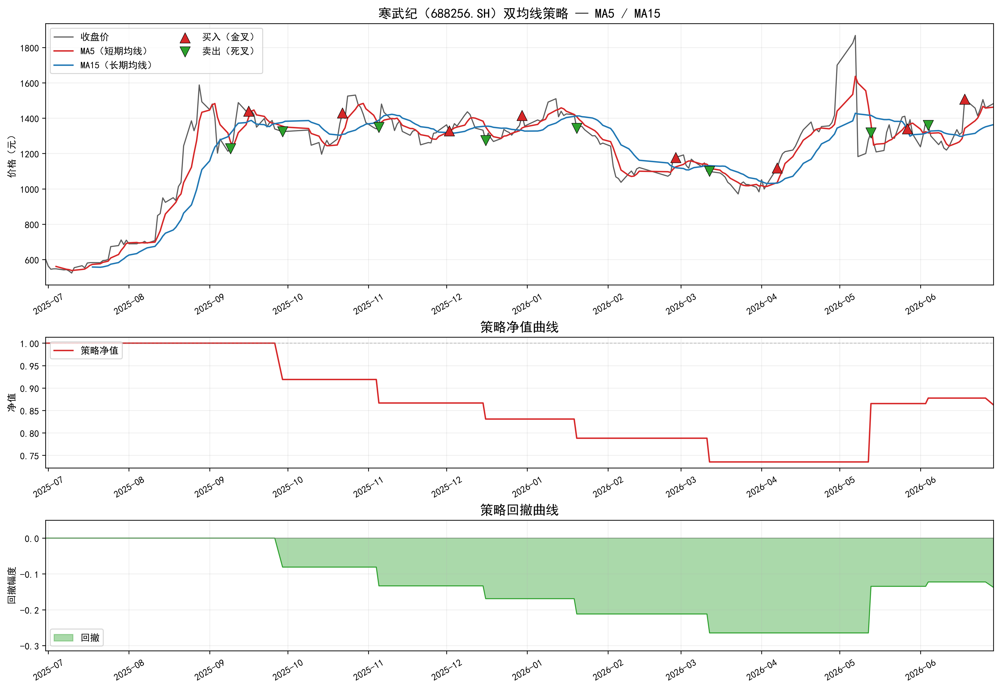
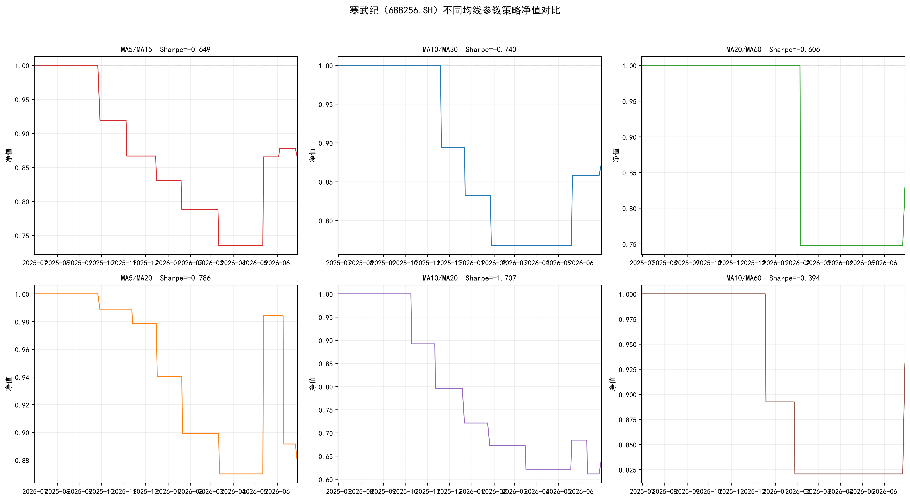
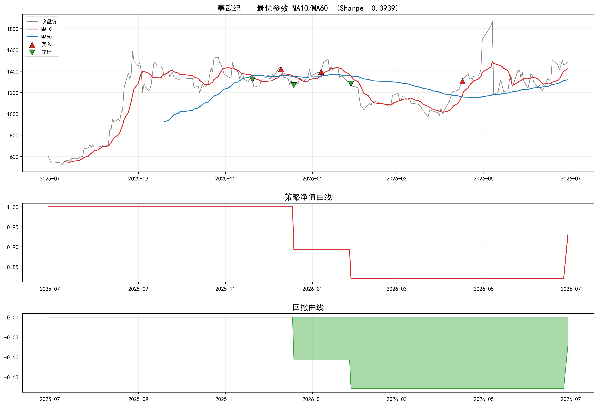
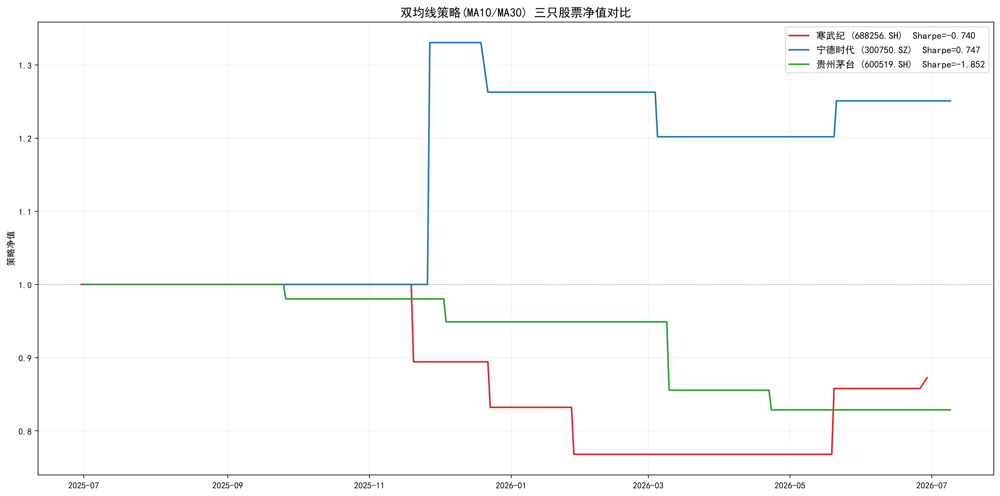

# TASK3：双均线策略及量化绩效评估

## 1 双均线策略基础

### 1.1 移动平均线概述

移动平均线（Moving Average，MA）是技术分析中应用最为广泛的趋势跟踪工具之一。其核心逻辑在于通过对一定时期内价格数据的算术或加权平均，滤除价格序列中的短期随机波动，从而揭示价格变动的长期趋势方向。依据计算方式的不同，移动平均线可主要分为简单移动平均线（Simple Moving Average, SMA）与指数移动平均线（Exponential Moving Average, EMA）两类。

SMA 对窗口内各观测值赋予等权重，计算公式为：

$$
\text{SMA}(N)_t = \frac{1}{N} \sum_{i=0}^{N-1} C_{t-i}
$$

等价地，分子也可展开写为 $C_t + C_{t-1} + \cdots + C_{t-N+1}$，其中下标 $t-N+1$ 表示距 t 日前 N-1 天的收盘价。

EMA 则通过递推形式对近期价格赋予更高权重，计算公式为：

$$
\text{EMA}(N)_t = \alpha \cdot C_t + (1 - \alpha) \cdot \text{EMA}(N)_{t-1}
$$

其中平滑系数 α = 2/(N+1)，因此 EMA 对价格变化的反应更为灵敏。

从功能角度看，移动平均线兼具三重作用。其一，趋势识别——价格位于均线上方通常反映上升趋势，反之则反映下降趋势。其二，支撑与阻力——上升趋势中均线常构成价格回调的支撑位，下降趋势中则构成反弹的阻力位。其三，信号生成——通过不同周期均线的交叉关系可生成交易信号，此即后文所述双均线策略的逻辑基础。

### 1.2 双均线策略的基本原理

双均线策略（Dual Moving Average Crossover Strategy）同时使用一条短期均线与一条长期均线，通过观察二者的相对位置关系判断趋势方向并生成交易信号。其基本逻辑是：当短期均线上穿长期均线时，意味着短期 momentum 强于长期趋势，发出买入信号；当短期均线下穿长期均线时，则意味着上升 momentum 衰竭，发出卖出信号。该策略的实质是以均线的滞后性换取趋势判断的稳定性——短期均线对价格变动敏感，能够较快反映价格的最新变化；长期均线则抗干扰能力更强，更能刻画市场的长期走势方向。

在实践中，投资者根据交易风格与标的波动特性选择不同的参数组合。例如，MA5 与 MA10 的组合适用于短线交易，信号频率较高但噪声也大；MA20 与 MA60 的组合则是中长线趋势跟踪的经典选择；而 MA50 与 MA250（年线）的组合常用于判断长期大趋势的方向。参数的选择直接影响策略的信号频率与可靠性，不存在普适的最优参数，通常需要结合回测分析进行优化。

### 1.3 金叉与死叉

金叉（Golden Cross）与死叉（Death Cross）是双均线策略中最为核心的两个概念。金叉指短期均线由下向上穿越长期均线的技术形态，被市场普遍视为买入信号，其背后逻辑在于短期上涨速度已超越长期平均水平，市场 momentum 转为正向。金叉的可靠性取决于多重因素：均线周期越长（如 MA50/MA250 组合），信号越可靠但出现频率越低；交叉角度越大，趋势反转的力度越强；若金叉形成时伴随成交量放大，则信号可信度显著提高；金叉出现在长期下跌后的低位区域时，其底部反转含义更为有效。此外，当均线在低位经历长期粘合后向上发散形成金叉时，往往预示横盘突破，后续上涨空间较大。

死叉则与之相反，指短期均线由上向下穿越长期均线，被视为卖出信号，标志着短期下跌速度已超过长期平均下跌速度，市场 momentum 转为负向。死叉的可靠性同样受均线周期、交叉角度、成交量配合与价格位置等因素的影响。高位死叉（长期上涨后出现的死叉）通常意味着顶部反转，其信号意义远强于低位死叉。金叉与死叉的实质互为镜像：金叉标志着市场由弱转强，死叉标志着市场由强转弱，二者共同构成了双均线策略完整的交易信号体系。

## 2 量化绩效评估基础指标

量化策略的有效性不能仅凭信号逻辑的合理性来判断，还需通过一系列定量指标对策略的历史表现进行客观衡量。下文将对最大回撤、夏普比率与累计回报这三个核心绩效指标进行阐述。

### 2.1 累计回报

累计回报（Cumulative Return）衡量的是策略在回测期内资产净值的总体增长幅度，是最直观的绩效度量指标。若策略的初始本金为 V₀，经过 T 个交易日后资产净值变为 V_T，则累计回报的计算方式为：

$$
R_{\text{cumulative}} = \frac{V_T - V_0}{V_0}
$$

累计回报通常以百分比形式呈现，其数值越大表明策略在考察期内的盈利能力越强。但需注意，累计回报仅反映期末相对于期初的总体收益水平，无法揭示收益的波动路径和期间风险。因此在实际评估中，累计回报需与风险调整后指标（如夏普比率）结合使用，以避免被极端收益所误导。

### 2.2 最大回撤

最大回撤（Maximum Drawdown, MDD）是衡量策略风险水平的核心指标之一。它度量的是在回测期间的任意时点入场可能遭遇的最大资产净值损失幅度，反映了策略在历史上最不利行情下的承受能力。其计算思路是：对于每个交易日，找到截至该日的历史最高资产净值（即"峰顶"），随后计算当前净值相对于该峰顶的回撤幅度，取所有回撤中的最大值。

设 V_t 为第 t 日的资产净值，则第 t 日的回撤（Drawdown）定义为：

$$
D_t = \frac{V_t - \max_{0 \leq s \leq t} V_s}{\max_{0 \leq s \leq t} V_s}
$$

最大回撤即为所有 D_t 中的最小值（即最大负向偏离）：

$$
\text{MDD} = \min_{0 \leq t \leq T} D_t
$$

MDD 的绝对值越小，说明策略的净值曲线越平稳、抗风险能力越强。例如，MDD 为 -20\% 意味着策略在最差情况下曾从历史高点回撤 20\%。在实际应用中，投资者通常将 MDD 作为风控阈值的一个重要参考——当回撤超过某个预设水平时，策略可能需要暂停或调整。

### 2.3 夏普比率

夏普比率（Sharpe Ratio）由 William Sharpe 于 1966 年提出，是衡量单位总风险所获得超额回报的经典指标。它将策略的收益与风险整合为一个数值，便于不同策略之间的横向比较。其计算方式为策略年化超额收益率（策略收益率减去无风险利率）除以策略年化收益率的标准差：

$$
\text{Sharpe Ratio} = \frac{E(R_p) - R_f}{\sigma_p}
$$

其中 E(R_p) 为策略的年化预期收益率，R_f 为无风险利率（通常取同期国债收益率或 Shibor），σ_p 为策略年化收益率的标准差。夏普比率越高，表明策略在承担单位风险时获得了越多的超额回报。根据经验法则，夏普比率大于 1 视为策略表现良好，大于 2 视为优秀，大于 3 则极为罕见。

夏普比率的局限性在于其假设收益服从正态分布，且对波动率的正负不加以区分——它将向上的正收益波动与向下的亏损波动等同视为风险。对于非正态分布的策略收益，可考虑使用索提诺比率（Sortino Ratio）等衍生指标作为补充。

## 3 双均线策略的 Python 实现与回测

### 3.1 加载已存储的股价数据

本节基于 Task 1 收集的寒武纪（688256.SH）过去一年日线行情数据进行编程实现与回测。数据文件为 `寒武纪_过去一年日线数据.csv`，共 242 个交易日（2025-07-01 至 2026-06-29）。使用 pandas 读取 CSV 文件后，将 trade_date 列转换为 datetime 格式并按日期升序排列。源数据包含 ts_code、trade_date、open、high、low、close、pre_close、change、pct_chg、vol、amount 共 11 个字段，本策略主要使用 close（收盘价）字段进行计算。

### 3.2 计算均线数据

设定短期均线周期为 5 日，长期均线周期为 15 日。采用简单移动平均线（SMA）进行计算，即对过去 N 个交易日的收盘价取算术平均数，公式为：

$$
\text{SMA}(N)_t = \frac{C_t + C_{t-1} + \cdots + C_{t-N+1}}{N}
$$

pandas 的 rolling 方法可便捷地实现滑动窗口计算。计算结束后，MA5 从第 5 个交易日开始有有效值，MA15 从第 15 个交易日开始有有效值。

### 3.3 计算买入卖出的交易信号

交易信号的判定规则为：若 MA5 由下向上穿越 MA15（即上一交易日 MA5 ≤ MA15 且当日 MA5 > MA15），则记为买入信号（金叉）；若 MA5 由上向下穿越 MA15（即上一交易日 MA5 ≥ MA15 且当日 MA5 < MA15），则记为卖出信号（死叉）。信号以数组形式存储，1 表示买入，-1 表示卖出，0 表示无操作。回测期内共产生 8 次买入信号和 8 次卖出信号，信号交替出现，符合双均线策略的预期形态。

### 3.4 可视化图形

依据计算结果绘制三面板可视化图形。上方子图展示收盘价曲线、MA5（红色线）、MA15（蓝色线）、金叉买入信号（红色向上三角 ▲）与死叉卖出信号（绿色向下三角 ▼）；中间子图展示策略净值曲线；下方子图展示策略回撤曲线。三个子图共享同一时间轴，便于对照分析信号与净值变化之间的关系。可视化结果如图 1 所示。

### 3.5 模拟交易与回测

模拟交易规则为：初始资金 1 元，采用全仓买卖（不考虑仓位管理）；当出现买入信号时以收盘价全仓买入，出现卖出信号时以收盘价全仓卖出。不考虑交易成本、滑点和税费。回测完成后计算三个量化指标。

累计回报衡量策略在回测期内的总体盈亏幅度，计算公式为：

$$
R_{\text{cumulative}} = \frac{V_T - V_0}{V_0}
$$

最大回撤衡量策略在历史最差情况下的净值损失，计算公式为：

$$
\text{MDD} = \min_{0 \leq t \leq T} \frac{V_t - \max_{0 \leq s \leq t} V_s}{\max_{0 \leq s \leq t} V_s}
$$

夏普比率衡量单位风险所获得的超额回报，计算公式为：

$$
\text{Sharpe Ratio} = \frac{E(R_p) - R_f}{\sigma_p}
$$

其中无风险利率取年化 2%。回测结果如表 1 所示。

**表 1 双均线策略（MA5/MA15）回测绩效**

| 指标 | 数值 |
|------|------|
| 累计回报 | -13.73% |
| 最大回撤（MDD） | -26.47% |
| 年化收益率 | -12.93% |
| 年化波动率 | 22.99% |
| 夏普比率（R_f=2%） | -0.6493 |
| 买入信号次数 | 8 |
| 卖出信号次数 | 8 |

可以看到，2025 年 7 月至 9 月底寒武纪股价快速上涨期间，策略因 9 月 9 日死叉信号提前离场，错失 9 月 16 日金叉后的主要上涨波段；2025 年 10 月至 2026 年 4 月的震荡下行阶段，策略多次反复开平仓，累积了一定亏损；2026 年 5 月以后的反弹中，策略重新捕捉到了部分上行机会，但最终全年仍录得负收益。回测结果表明，MA5/MA15 这一组短期均线参数对寒武纪这一波动较大的科技股而言偏敏感，金叉死叉出现过于频繁，导致策略在震荡市中被反复打损，累积了不必要的损失。

## 4 不同股票与均线周期的实证分析

### 4.1 多参数回测对比

为评估均线周期选择对策略表现的影响，以寒武纪为测试标的，设定六组参数组合进行回测对比。结果如表 2 所示。

**表 2 寒武纪不同均线参数回测对比**

| 参数 | 累计回报 | 最大回撤 | 夏普比率 | 年化收益 | 年化波动 | 交易次数 |
|------|----------|----------|----------|----------|----------|----------|
| MA5/15 | -13.73% | -26.47% | -0.6493 | -12.93% | 22.99% | 16 |
| MA10/30 | -12.75% | -23.21% | -0.7395 | -12.36% | 19.42% | 10 |
| MA20/60 | -17.09% | -25.21% | -0.6055 | -15.02% | 28.10% | 4 |
| MA5/20 | -12.35% | -13.01% | -0.7858 | -12.19% | 18.06% | 16 |
| MA10/20 | -35.88% | -38.86% | -1.7071 | -42.83% | 26.26% | 16 |
| **MA10/60** | **-6.94%** | **-17.93%** | **-0.3939** | **-5.65%** | 19.43% | 6 |

从六组参数的对比中可以看出以下规律：

第一，参数选择对策略表现的影响极为显著。六组参数均为负收益，但亏损幅度从 -6.94% 到 -35.88% 不等，夏普比率从 -0.39 到 -1.71 不等，差异巨大。其中 MA10/60 组合在累计回报（-6.94%）和夏普比率（-0.3939）两个维度上均表现最佳。

第二，信号频率与策略表现并非单调关系。交易次数最多的 MA5/15、MA5/20 和 MA10/20（均为 16 次）表现最差，其中 MA10/20 的累计亏损高达 -35.88%、回撤达 -38.86%。而交易次数最少的 MA20/60（仅 4 次）同样表现不佳，累计亏损 -17.09%。信号次数居中的 MA10/30（10 次）和 MA10/60（6 次）反而相对稳健。这表明信号过少可能错过反转时机，信号过多则容易被震荡市打损，适中的信号频率往往效果更好。

第三，短期均线与长期均线的周期差距（即带宽）对策略表现有重要影响。MA5/15 与 MA10/20 的带宽均为 10，但前者损失远小于后者（-13.73% 对 -35.88%），说明短期均线的基准位置同样关键。MA10/60 以 50 的带宽隔最大，信号间隔最长，反而在全年下行趋势中最大限度降低了损失。

不同参数下的策略净值曲线对比如图 2 所示。

最优参数（MA10/60）的全景回测结果如图 3 所示，包含股价走势与买卖信号、策略净值曲线和回撤曲线。

### 4.2 不同股票的对比分析

为检验双均线策略在不同类型股票上的表现差异，选取寒武纪（688256.SH，高波动科技股）、宁德时代（300750.SZ，成长型新能源龙头）和贵州茅台（600519.SH，大盘蓝筹消费股）三只具有代表性的 A 股，统一采用 MA10/MA30 参数进行回测对比。回测期间为 2025 年 7 月至 2026 年 7 月，结果如表 3 所示。

**表 3 三只股票 MA10/MA30 回测对比**

| 股票 | 代码 | 累计回报 | 最大回撤 | 夏普比率 | 年化收益 | 年化波动 | 交易次数 |
|------|------|----------|----------|----------|----------|----------|----------|
| 寒武纪 | 688256.SH | -12.75% | -23.21% | -0.7395 | -12.36% | 19.42% | 10 |
| 宁德时代 | 300750.SZ | **+25.08%** | **-9.67%** | **+0.7471** | **+27.65%** | 34.33% | 8 |
| 贵州茅台 | 600519.SH | -17.14% | -17.14% | -1.8515 | -18.46% | 11.05% | 8 |

三只股票的策略净值曲线对比如图 4 所示。

从上述对比中可以得出以下结论：

第一，**双均线策略在相同参数下对不同股票的表现差异悬殊**。宁德时代在 MA10/MA30 参数下实现了正收益（累计回报 +25.08%，夏普比率 0.7471），而同样参数下寒武纪和贵州茅台均为负收益。这说明策略的有效性高度依赖于标的股票的价格走势特征，而非通用的参数设定所能保证。

第二，**波动率本身并非决定因素**。宁德时代的年化波动率最高（34.33%），但策略收益也最高；贵州茅台的波动率最低（11.05%），但策略亏损反而最大。这一现象表明，双均线策略更依赖于价格走势的**趋势性**而非波动幅度——宁德时代在回测期内形成了较为清晰的中期上涨趋势，均线交叉信号能够有效跟随；而贵州茅台虽然波动温和，但全年呈现震荡下行态势，均线交叉难以获利。

第三，**宁德时代的优异表现验证了双均线策略在趋势行情中的有效性**。其 8 次交易信号（4 次金叉、4 次死叉）捕获了主要上涨波段，最大回撤仅 -9.67%，风险控制良好。相比之下，寒武纪虽然波动特征与宁德时代类似，但其全年价格走势缺乏持续的单边方向，导致策略反复受损。

### 4.3 双均线策略试用场景总结与应用心得

综合以上全部实证分析，对双均线策略的试用场景总结如下：

**适用场景**：双均线策略最适合有明确单边趋势的市场环境——在趋势行情中，金叉和死叉能够有效捕获主要涨跌波段。对趋势性较强的标的（如处于上升通道的成长股），策略表现往往优于横盘震荡的标的。

**不适用场景**：在横盘震荡或"猴市"中，均线频繁交叉产生大量虚假信号，策略表现显著恶化。对波动率极高的科技股，若缺乏持续的趋势方向，双均线策略容易被剧烈波动反复打损。

**应用心得**：

其一，**参数需与标的特性匹配**。寒武纪六组参数的对比显示，同一只股票使用不同均线参数，累计回报可从 -35.88% 到 -6.94% 不等，差异之大远超预期。MA10/60 在寒武纪表现最佳，说明对高波动标的宜用较大带宽的参数组合以过滤短期噪音；而对趋势稳定的标的可适当收窄参数。没有通用最优参数，必须针对具体标的做回测优化。

其二，**信号频率是把双刃剑**。信号过多（如 MA10/20 的 16 次交易）在震荡市中反复受损，信号过少（如 MA20/60 仅 4 次）则可能错过关键反转。MA10/60 的 6 次信号在寒武纪上效果最好——适中的信号频率既能捕捉主要趋势变化，又不会被短期波动过度干扰。

其三，**绝对收益不是唯一的评价标准**。在整体下行的市场环境中，双均线策略难以创造正收益，但这不意味着策略本身无效。更合理的评价方式是将其与基准（如买入持有策略）进行比较。例如，寒武纪在回测期内价格从 1000 元附近跌至约 530 元（跌幅约 47%），而双均线策略最大亏损为 -26.47%，在一定程度上起到了控制下行风险的作用。

其四，**应与其他工具结合使用**。双均线策略的一阶本质决定了它无法区分趋势行情与震荡行情。结合更大周期均线的方向做趋势过滤、引入成交量确认避免假突破、配合布林带 Bandwidth 识别震荡区间并暂停交易，是三种行之有效的改进方向。策略的改进永无止境，回测中的历史表现不能保证未来的收益，风险管理始终应当置于首位。
