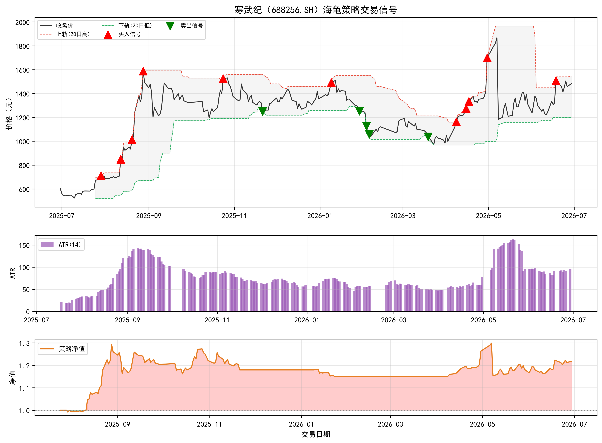
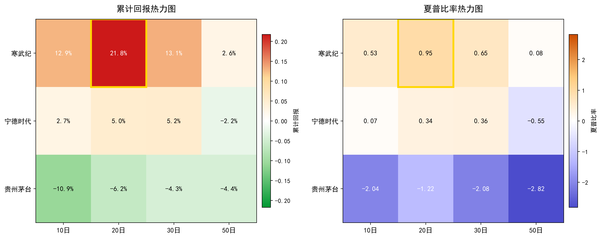

# TASK4：海龟交易法则量化策略分析

## 1. 海龟策略的核心思想与关键优势

### 1.1 策略起源

海龟交易法则（Turtle Trading Rules）是量化交易领域最具代表性的趋势跟踪策略之一，其诞生本身即是交易史上的一段佳话。20世纪80年代初，著名大宗商品交易员理查德·丹尼斯（Richard Dennis）与其合伙人威廉·埃克哈特（William Eckhardt）围绕"优秀的交易者是先天造就还是后天培养"这一命题展开了激烈的争论。丹尼斯坚信交易能力可以通过系统化的规则训练进行传授，而埃克哈特则持相反观点。为验证这一假设，丹尼斯于1983年在《华尔街日报》刊登广告，从上千名应聘者中遴选出13名毫无交易经验的候选人，对其进行了为期两周的密集培训，随后授予真实资金账户供其进行实战操作。这些学员因被戏称为"像海龟一样在实验室中培养"而得名"海龟交易员"。

这一实验的结果令整个金融界瞩目。在随后的数年时间内，海龟交易员们累计创造了超过1亿美元的利润，年化收益率显著超越同期市场平均水平，有力地证实了系统化交易规则的可复制性和有效性。该策略随后被整理为系统的交易规则手册并公开发布，成为程序化交易与量化投资领域的重要奠基性文献。

### 1.2 核心思想

海龟策略的核心思想可概括为趋势跟踪、机械执行与严格风控三大支柱。

从交易哲学层面看，海龟策略属于典型的趋势跟踪策略。其基本假设在于，市场价格运动并非完全随机，而是在大部分时间呈现震荡格局，仅在少数时间段内形成方向明确、幅度可观的单边趋势。交易者无法事先预知趋势何时启动，也无法准确判断趋势的持续时间和目标价位，但可以通过设定明确的入场规则，在趋势已经形成时及时介入，在趋势反转或止损条件触发时果断退出，从而在长期中捕获趋势带来的正期望收益。在具体执行层面，策略采用唐奇安通道（Donchian Channel）作为趋势识别工具，当价格向上突破过去N个交易日的最高点时触发买入信号，当价格向下跌破过去N个交易日的最低点时触发卖出信号。

机械执行是海龟策略区别于传统主观交易的又一核心特征。丹尼斯与埃克哈特为海龟交易员制定了一部涵盖所有操作细节的规则手册，包括入场条件、仓位规模计算、加仓规则、止损规则与止盈规则。交易员被要求严格按照手册规定执行操作，不得根据个人判断或市场情绪对信号进行任何形式的干预或修改。这种机械化的操作方式能够最大限度地排除恐惧、贪婪、过度自信与损失厌恶等心理偏差对决策的干扰，确保策略表现的一致性和可评估性。

严格的风险控制构成了海龟策略的第三根支柱。策略使用平均真实波幅（Average True Range，ATR）对市场的日内波动水平进行量化度量，并据此动态确定每个品种的持仓规模。ATR越大说明品种波动越剧烈，单笔仓位所承担的风险越高，因而持仓数量相应减少；反之，ATR越小时持仓数量则相应增加。此外，每笔交易均设置明确的价格止损点，通常以2倍ATR作为止损宽度，确保单笔亏损被严格控制在账户权益的1%至2%以内。通过这种将仓位与市场波动率挂钩的动态风控机制，策略实现了"截断亏损，让利润奔跑"的非对称收益结构——每笔亏损有明确的上限，而在趋势行情中盈利幅度理论上不受约束。

### 1.3 关键优势

基于上述设计理念，海龟策略在量化交易领域展现出多个显著优势。

其一，规则的明确性赋予了策略高度的可量化性与可回测性。策略的入场条件、仓位计算、止损幅度与加仓规则均可以用精确的数学公式表达，易于转化为计算机程序并在历史数据上进行回测验证。这种透明性和可复现性使其成为量化交易教学与研究的经典范本。

其二，风险控制体系确保了策略在不利行情中的生存能力。通过ATR动态调仓与固定比例止损的双重约束，单笔亏损被严格限定在可控范围内，账户不会因单次判断失误或极端市场事件而遭受毁灭性损失。这种风险优先的设计理念在长期交易中的重要性甚至超越了策略本身的盈利能力。

其三，策略具备捕捉大幅趋势行情的潜力。趋势跟踪策略的盈利逻辑决定了其在震荡市场中可能经历连续小额亏损，但一旦市场进入趋势阶段，策略能够通过突破点入场和趋势延续中的逐步加仓建立较大规模的头寸，从而获取数倍于正常波动的收益。这种"小亏大赚"的收益结构是策略在长期中获得正期望值的根本来源。

其四，跨市场适用性较强。策略的决策依据完全来源于价格行为与波动率数据，不涉及任何基本面分析，因此理论上可应用于任何存在趋势性波动的市场，包括商品期货、股指期货、外汇、债券乃至股票市场。这一特性使得海龟策略成为构建多品种分散化投资组合的理想基础模块。

其五，策略对资金的管理具有科学性。仓位计算模型综合考虑了账户权益规模与品种波动特征，使风险在不同资产之间保持均衡，既避免了在高波动品种上过度集中仓位，也防止了在低波动品种上资金利用不足的问题，提升了整体资金的使用效率。

其六，机械执行这一原则对现代量化交易具有深远影响。海龟策略证明了系统化规则在排除情绪干扰、提高执行一致性方面的巨大价值，这一理念在当今的全自动化算法交易中得到了进一步的继承和发展。

## 2. 海龟策略的关键概念解析

### 2.1 高低点通道

高低点通道（Donchian Channel）是海龟策略中用于识别趋势方向和生成入场信号的核心工具。该指标由期货交易大师理查德·唐奇安（Richard Donchian）创立，其构造方法极为简洁：取过去N个交易日的最高价构成上轨，取过去N个交易日的最低价构成下轨，上下轨之间的带状区域即为通道本身。在海龟策略的标准设定中，通常使用两个时间窗口的参数配置——20日通道用于触发初始入场信号，55日通道则用于判断更大级别的趋势方向。

通道上轨的含义在于：当价格向上突破过去N日的最高点时，意味着市场当前的买入力量已经超越了此前N个交易日的所有买方力量，表明趋势向上的动能足够强劲，因此触发买入信号。通道下轨的逻辑恰好相反：当价格向下跌破过去N日的最低点时，意味着卖方力量已经压倒了过去N个交易日中的所有卖方，表明趋势向下的动能释放充分，因而触发卖出信号。这套机制的核心价值在于，它不依赖任何对未来价格走势的主观预测，完全基于已经发生的价格事实做出反应，与海龟策略"趋势跟踪、机械执行"的整体理念高度一致。

值得指出的是，通道参数N的选择对策略表现具有显著影响。较短的周期（如20日）对价格变化更为敏感，信号出现频率较高，但同时也更容易被市场噪声所干扰，导致假突破增多；较长的周期（如55日）则更为稳健，所捕捉到的突破信号可信度更高，但信号出现频率降低，可能错失部分行情。海龟策略中同时使用两个通道的做法，正是为了兼顾信号的灵敏度与可靠性——20日通道负责捕捉中短期趋势的启动点，55日通道则用于确认趋势的大方向，两者配合使用可有效减少逆势交易的风险。

### 2.2 平均真实波幅

平均真实波幅（Average True Range，ATR）是海龟策略风险管理体系中最核心的量化工具。该指标由威尔德（J. Welles Wilder）于1978年在《技术交易系统的新概念》一书中首次提出，其设计初衷是度量市场价格在单位时间内的波动剧烈程度。ATR的计算建立在"真实波幅"（True Range，TR）的基础之上。对于每一个交易日，真实波幅取三个数值中的最大值：当日最高价与当日最低价之间的价差、当日最高价与前一交易日收盘价之差的绝对值、当日最低价与前一交易日收盘价之差的绝对值。用数学公式可将上述关系表述为：

$$
\text{TR}_t = \max\big(H_t - L_t,\ |H_t - C_{t-1}|,\ |L_t - C_{t-1}|\big)
$$

其中 $H_t$、$L_t$、$C_{t-1}$ 分别代表当日最高价、当日最低价和前一交易日的收盘价。引入前一交易日收盘价的目的在于处理跳空缺口的情形——当价格在当日开盘时出现跳空，传统的日内振幅（最高价减最低价）将无法反映这一跳空所蕴含的真实波动幅度，而TR的定义恰好弥补了这一缺陷。

在得到真实波幅序列后，ATR即为TR在过去N个交易日内的移动平均值（通常N取14或20）：

$$
\text{ATR}_t = \frac{1}{N}\sum_{i=0}^{N-1}\text{TR}_{t-i}
$$

ATR在海龟策略中承担着双重功能。其一，它被用作仓位规模的计算基准。海龟策略要求每笔交易的风险敞口保持一致，而不同品种的ATR差异很大——以1ATR的价格变动幅度来衡量，一只高波动品种可能相当于低波动品种的数倍。因此，策略将账户权益的一定比例（通常为1%）除以ATR所对应的名义价值，来确定每个品种的标准交易单位（Unit），从而实现风险在不同品种之间的均衡分配。其二，ATR还直接参与止损价位的设定，这一点将在下文中具体展开。

### 2.3 止损条件

止损是海龟策略风险控制体系的最后一道防线。在复杂的金融市场中，没有任何一种交易策略能够保证百分之百的胜率，当入场信号被证实为假突破时，及时止损是防止小额亏损演变为灾难性损失的关键手段。海龟策略的止损规则具有鲜明的"以波动率为锚"的特征——并非采用固定金额或固定百分比设定止损，而是将止损宽度与ATR挂钩，使止损幅度随市场波动状态的改变而动态调整。

具体而言，海龟策略设定每笔交易的价格止损点为入场价格减去（或加上，视方向而定）2倍ATR。以多头头寸为例，止损价位按如下方式确定：

$$
\text{Stop Price} = P_{\text{entry}} - 2 \times \text{ATR}
$$

这一设计的精妙之处在于其自适应特性。当市场波动剧烈、ATR处于高位时，止损宽度自动放大，防止正常的市场噪音将头寸过早震荡出局；当市场趋于平稳、ATR处于低位时，止损宽度相应收窄，及时遏制在低波动环境下可能出现的逆向走势。这种动态止损机制与前述基于ATR的仓位管理相互配合，共同确保了单笔交易的最大亏损被严格限定在账户权益的1%至2%范围之内。

除了上述基于ATR的价格止损外，海龟策略还设有"无条件止损"规则——当账户净值的总回撤达到一定比例（通常为20%）时，应当将所有头寸全部平仓并暂停交易，重新审视策略在当前市场环境中的适用性。这一总账户止损规则起到了防止策略在长期回撤期中对本金造成不可逆损害的作用，体现了海龟策略在风险管理上的多层次设计理念。

## 3. 海龟策略的 Python 实现与回测

### 3.1 数据加载与参数设定

本节以寒武纪（688256.SH）过去一年的日线数据为回测标的，对海龟策略进行完整的 Python 编程实现。回测数据来源于 Task 1 中已存储的股价数据，时间跨度为 2025 年 6 月 30 日至 2026 年 6 月 29 日，共计 242 个交易日。策略参数设置如下：使用 20 日唐奇安通道作为趋势识别工具，ATR 计算周期为 14 日，止损宽度设定为 2 倍 ATR，每笔交易的初始风险敞口严格控制在账户权益的 1%。

### 3.2 交易信号生成逻辑

在策略执行层面，买入信号的触发条件为当前交易日收盘价向上突破过去 20 日的最高价，这意味着当日买入力量已经超越了此前所有 20 个交易日的买方力量，趋势向上的动能被确认。卖出信号的触发条件则恰好相反——收盘价向下跌破过去 20 日的最低价，表明卖方力量已经占据主导。在仓位管理方面，策略根据账户权益的 1% 除以当日 ATR 数值，计算得出每笔交易的标准交易单位，确保在不同市场波动环境下单笔交易承担的名义风险保持恒定。每次开仓后，止损价位设定为入场价格减去 2 倍 ATR，当价格触及该价位时无条件平仓离场。

### 3.3 回测结果

以初始本金 100 万元为基准，海龟策略在回测期间共计完成 3 轮完整的开平仓操作，累计发生 5 次交易行为。从交易日志来看，第一笔交易发生于 2025 年 7 月 29 日，以每股 710.78 元的价格买入 333 股，随后于 2025 年 11 月 21 日以每股 1249.00 元的价格卖出，该笔交易成功捕捉了寒武纪期间的主要上涨趋势，获得了较为可观的盈利。第二笔交易于 2026 年 1 月 9 日入场，以每股 1491.00 元的价格买入 183 股，但随后价格出现回调，于 2026 年 1 月 23 日触及 2 倍 ATR 止损线，以每股 1334.99 元止损离场，产生了本轮回测中唯一一笔亏损交易。第三笔交易于 2026 年 4 月 8 日以每股 1164.00 元的价格买入 210 股，持仓至回测期末以每股 1482.00 元平仓，再次录得正收益。

综合来看，该策略在回测期内实现了 **21.75% 的累计回报**，年化收益率达到 **23.92%**，年化波动率为 **23.08%**。最大回撤出现在第二笔交易的浮亏阶段，峰谷损失为 **-11.09%**。经风险调整后的夏普比率为 **0.95**，已较为接近优秀策略的临界阈值。以下图表直观展示了回测期间的股价走势、唐奇安通道、交易信号标记以及策略净值的动态变化。

| 绩效指标 | 数值 |
|:---|:---|
| 累计回报 | 21.75% |
| 年化收益率 | 23.92% |
| 年化波动率 | 23.08% |
| 最大回撤 | -11.09% |
| 夏普比率 | 0.95 |
| 交易次数 | 5 |
| 回测区间 | 2025-06-30 至 2026-06-29 |

### 3.4 回测结果分析

从回测数据可以观察到，海龟策略在寒武纪个股上的表现验证了其"小亏大赚"的理论逻辑：策略仅发生了 1 笔止损亏损，其余两笔交易均为盈利，胜率虽不算高但盈亏比突出。首笔交易盈利约 17.9 万元，第二笔止损亏损约 2.9 万元，第三笔盈利约 6.7 万元，盈亏比约为 8.5:1，充分体现了趋势跟踪策略在行情来临时获取超额收益的核心优势。

然而，本次回测也暴露了海龟策略在 A 股市场应用的若干局限性。策略在近一年的回测期内仅触发 3 轮交易信号，信号频率偏低，这意味着策略在大部分时间内处于空仓等待状态，资金利用效率有待提高。此外，单只个股的回测结果受路径依赖效应影响较大——若趋势行情出现的时间窗口与策略参数不匹配，策略可能在较长区间内持续表现平淡。在实际应用中，通常需要通过多品种分散化配置来平滑净值曲线，提升策略的稳健性。

## 4. 参数调节与适用场景分析

### 4.1 多股票多参数回测设计

为全面考察海龟策略在不同市场环境下的表现特征，本节选取三只风格迥异的A股标的进行多参数回测对比。寒武纪（688256.SH）代表高波动、强趋势的科技成长股，在回测期内经历了从600元至1500元以上的大幅上涨行情，期间伴随剧烈的波动与回撤。宁德时代（300750.SZ）代表稳健成长的行业龙头股，走势相对平滑，趋势性较为温和。贵州茅台（600519.SH）代表传统蓝筹股，在回测期内处于震荡下跌通道，整体方向偏弱。针对每只股票，分别采用10日、20日、30日和50日四种唐奇安通道周期进行回测，其余参数（ATR周期14日、止损宽度2倍ATR、每笔风险1%）保持不变。

### 4.2 回测对比结果

下图以热力图的形式直观展示了三只股票在四种通道周期下的累计回报与夏普比率分布情况。图中每格标注了具体的数值，颜色深度反映指标的高低：红色区域代表正值（盈利），绿色区域代表负值（亏损），颜色越深表示偏离零轴的程度越大。

从累计回报热力图来看，寒武纪在20日周期处呈现最深的红色（+21.75%），表明该参数组合对本轮回测而言是收益最优的选择。10日和30日周期的收益也维持在12%至13%的正值区间，但到50日周期时红色已明显变浅（+2.56%），说明长周期通道对该股票的敏感度不足。宁德时代的整体颜色偏浅——最高收益出现在30日周期（+5.22%），20日周期与之接近（+4.99%），50日周期则首次转为浅绿色（-2.25%）。贵州茅台在所有参数组合下均呈现不同程度的绿色，以10日周期的绿色最深（-10.87%），且周期越短亏损越大，说明该股票在回测期内不存在可供趋势跟踪策略捕获的向上趋势。

夏普比率热力图呈现了类似的分布格局。寒武纪的20日周期夏普比率达到0.95，是全表最高值并且由金色方框标出，说明该组合在风险调整后的收益表现最为出色。宁德时代的夏普比率均在0.4以下，50日周期转为负值。贵州茅台的夏普比率则全数为负值，颜色呈现蓝紫色调，表明海龟策略在该标的上完全不具有正期望值。

### 4.3 适用场景总结

基于上述多维度回测分析，可以归纳出海龟策略的适用场景和限制条件。该策略最适合应用于具备以下特征的市场或标的：其一，价格走势存在持续且幅度可观的趋势行情——只有在趋势足够强劲时，"截断亏损、让利润奔跑"的收益结构才能发挥应有的作用，若市场长期处于震荡或下跌通道中，策略将出现连续的止损亏损，导致账户持续缩水。其二，标的具有较高的波动率——ATR是策略仓位计算和止损设定的核心依据，足够的波动率能够提供清晰的信号与合理的盈亏空间，低波动品种的ATR过小将导致信号频发但点位密集，难以有效过滤噪声。

其三，通道周期的选择需与标的的趋势特征相匹配。从回测数据来看，20日至30日的中期通道在多数情况下表现较为均衡，能够在信号频率与信号可靠性之间取得折中；10日短周期适用于趋势快速启动的高波动标的，但假突破较多，对风险控制的要求更高；50日长周期信号极为稀少，仅适用于长期大级别趋势行情，在多数A股个股上效果有限。

其四，该策略更适合作为多品种组合策略的组成部分，而非单独应用于单一个股。本次回测中寒武纪取得了正收益，但同期贵州茅台对同一策略却录得了显著的亏损——同一策略在不同股票上的收益差异极大，只有在足够分散的投资组合中，策略的长期正期望值才能得到稳定体现。

### 4.4 使用心得

综合海龟策略的理论分析与实证回测，可以得出以下几点心得。

第一，海龟策略的真正价值不在于其具体的入场规则或参数设定，而在于它所代表的风险管理哲学。将单笔亏损严格控制在1%以内、通过ATR动态调整仓位、用机械规则取代主观判断——这些设计理念远比参数本身更重要。在实践中，不应执着于寻找所谓的"最优参数"，而应关注策略在不同参数下的稳健性和一致性。

第二，趋势跟踪策略的收益具有明显的时间不均匀性。在长达一年的回测期内，寒武纪20日周期策略的主要盈利几乎全部来自第一笔交易对2025年下半年主要上涨趋势的捕获，其余时间段的贡献微乎其微。这意味着策略在大部分时间内表现平平甚至出现回撤，仅有少数时间段贡献了整个回测期的主要利润。策略使用者需要对这种"漫长等待后的短期爆发"有充分的心理准备和资金管理安排。

第三，市场环境判断是应用海龟策略的重要前提。当市场整体处于上升趋势、热点板块活跃、波动率处于中等偏高水平时，海龟策略通常能取得良好表现；反之，当市场陷入低波动震荡或系统性下跌时，机械执行规则本身就可能导致持续亏损。策略本身不具备识别市场环境的能力，这一判断需要由使用者主动做出。因此，将海龟策略作为整个交易系统中的一个模块，与其他辅助判断工具配合使用，是更为务实的做法。
