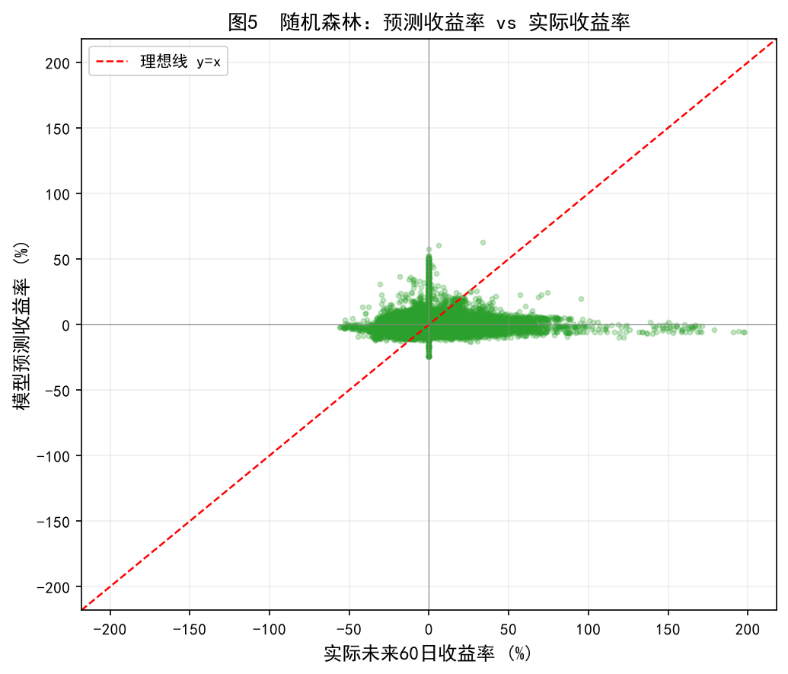
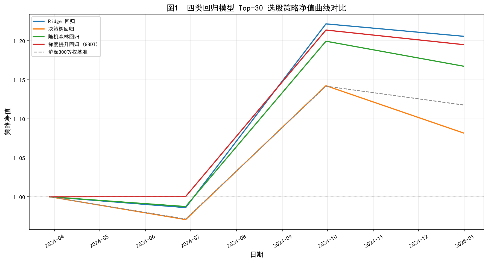
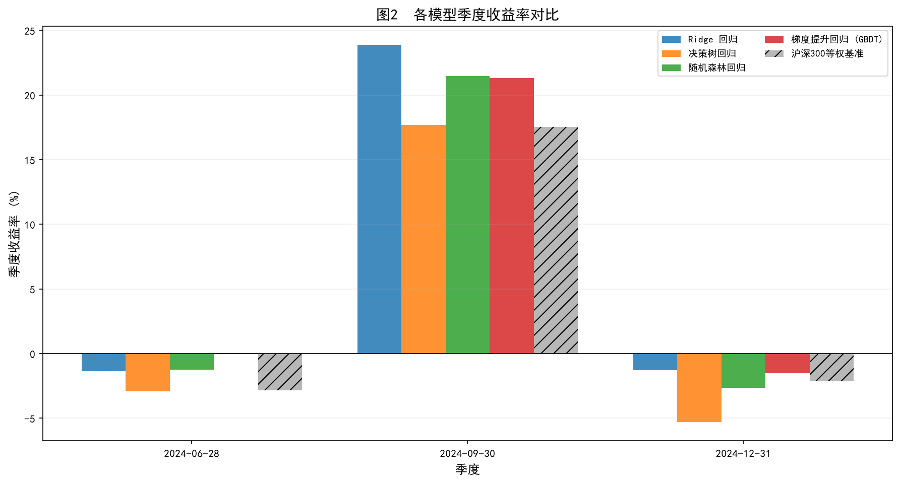
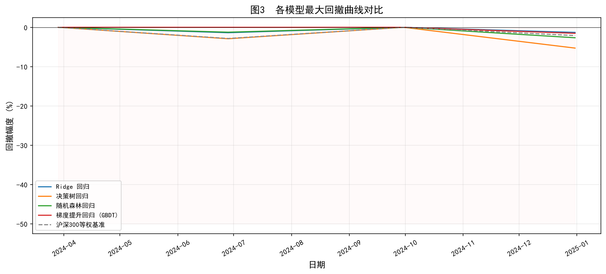
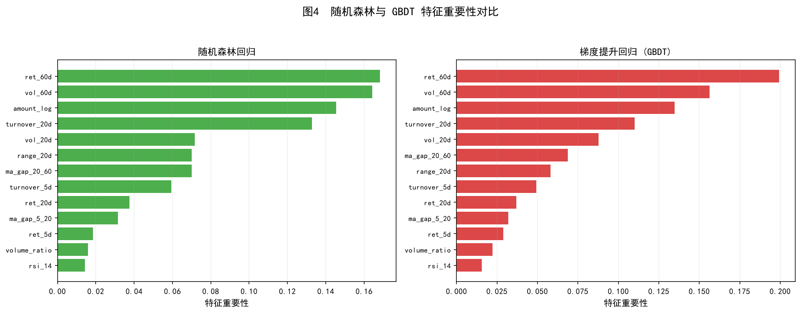
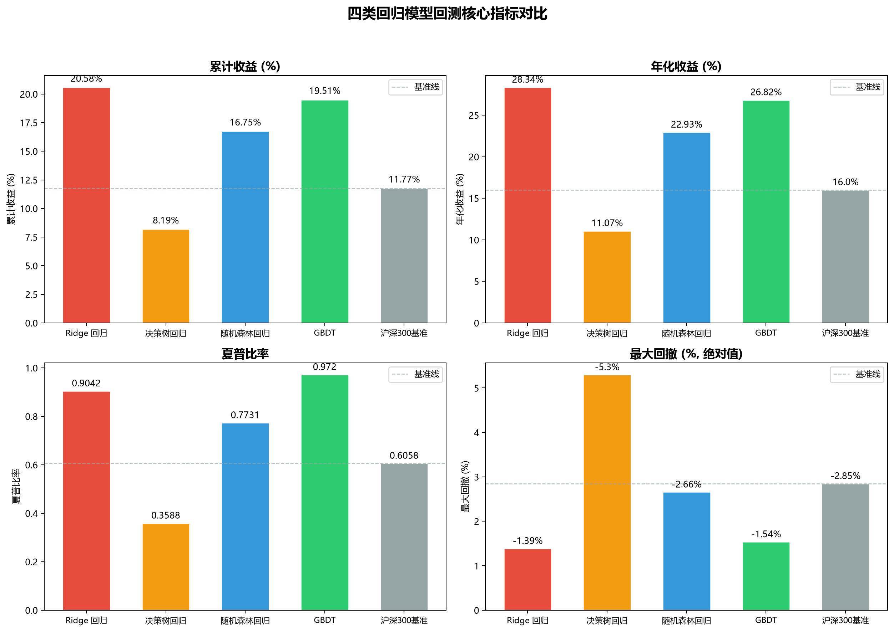

# TASK6：智能决策者——用机器学习定制专属策略

## 1. 基于机器学习模型的交易策略核心理念与优缺点

### 1.1 核心理念

基于机器学习模型的交易策略，是指利用历史金融市场数据（包括价格、成交量、财务指标等多维度信息）作为输入，通过机器学习算法自动学习数据中蕴含的规律，进而预测未来股票收益率或价格走势，并据此构建系统性投资组合策略的方法体系。与传统的技术指标驱动型策略（如双均线策略、海龟交易法则）不同，机器学习策略不依赖于人工预设的单一规则，而是让模型从海量数据中自主发现多因子之间的非线性组合关系，从而实现更精细的收益预测与更优的选股决策。

本策略的核心流程可概括为以下四个环节。第一，数据准备与因子工程：从历史行情数据中提取动量、波动率、换手率、量价关系、技术指标等多类因子作为模型自变量，同时定义未来一段时间的累计收益率作为应变量。第二，模型训练：在训练集上拟合回归型机器学习模型，学习因子与未来收益之间的映射关系。第三，策略构建：在每个季度末，利用训练好的模型对候选股票池中的所有股票进行收益率预测，选取预测收益最高的前30只股票等权持有。第四，回测评估：在测试集上按季度滚动执行选股与调仓，计算策略的累计收益、年化收益、夏普比率、最大回撤等核心指标，并与等权基准进行对比。

从方法论角度审视，本策略属于横截面选股（Cross-Sectional Stock Selection）范式。横截面选股的核心思想在于：在同一时间点上，对所有候选股票进行相对收益预测并排序，买入预测排名靠前的股票、卖出或规避排名靠后的股票，从而获取超额收益。这种范式与时间序列预测（Time-Series Forecasting）有本质区别——后者关注的是单只股票未来价格的绝对涨跌方向，而前者关注的是多只股票之间的相对优劣排序。研究表明，在金融市场中，准确预测个股的绝对收益率极为困难，但预测股票间的相对排序则相对更具可行性，这也是横截面选股策略在实务中被广泛采用的根本原因。

### 1.2 优势

基于机器学习模型的交易策略具有以下显著优势。

第一，非线性建模能力强。金融市场中因子与收益之间的关系往往不是简单的线性映射，而是存在复杂的交互效应和非线性结构。例如，低换手率在牛市中可能是正面信号，但在熊市中则可能意味着缺乏关注度而表现不佳。决策树、随机森林和梯度提升等树类模型能够自动捕捉这类条件依赖关系，而无需人工预设交互项。

第二，多因子整合能力。传统策略通常依赖单一或少数几个因子（如均线交叉），而机器学习模型可以同时纳入数十个甚至上百个因子，自动学习各因子的权重分配和组合方式。这使得模型能够综合考量动量、波动率、换手率、技术形态等多个维度的信息，避免单一因子在不同市场环境下失效的风险。

第三，自适应与数据驱动。机器学习模型通过数据驱动的方式自动学习市场规律，无需交易者主观设定参数阈值。当市场环境发生变化时，只需用新数据重新训练模型即可实现策略的迭代更新，具有较强的适应性。

第四，可量化与可回测。机器学习策略的全部决策逻辑（因子计算、模型预测、选股规则、调仓频率）均可以用精确的数学公式和计算机程序表达，这使得策略的表现可以被完整地记录、复现和评估。这种透明性为策略的持续优化提供了坚实基础。

第五，风险可控。通过横截面选股的方式分散持仓于多只股票（本策略选取Top-30等权配置），可以有效降低个股特异性风险。同时，模型输出的预测收益排序可以用于动态调整仓位权重，实现基于预测信心的风险管理。

### 1.3 局限性

尽管机器学习策略具有上述优势，但在实际应用中也面临若干重要局限。

第一，过拟合风险突出。金融数据的信噪比（Signal-to-Noise Ratio）极低，有效信号往往被大量噪声所淹没。在低信噪比环境下，复杂模型容易在训练集上取得看似优异的表现，但在样本外迅速失效。这是机器学习策略在实盘中面临的最核心挑战，需要在模型选择、正则化、交叉验证等环节进行严格控制。

第二，样本外失效问题。金融市场具有非平稳性（Non-stationarity）特征——过去有效的规律在未来可能不再成立。市场风格切换、宏观经济周期变动、监管政策调整等因素都可能导致因子有效性发生结构性变化，使得在历史数据上训练的模型在未来表现大幅下滑。

第三，可解释性不足。特别是随机森林和梯度提升等集成模型，其内部决策机制呈黑箱特性，难以用人类可理解的逻辑解释模型为何做出某一预测。当策略出现亏损时，难以快速定位是哪个因子或哪个环节出了问题，增加了策略运维和风险诊断的难度。

第四，交易成本冲击。频繁的季度调仓会产生交易佣金、滑点和冲击成本，这些费用会直接侵蚀策略的超额收益。在实际应用中，必须将交易成本纳入回测框架，否则会高估策略的真实盈利能力。

第五，数据窥探偏差（Data Snooping Bias）。在回测过程中，如果反复尝试不同的因子组合、模型参数和策略规则，直到找到历史表现最优的配置，实际上是在"拟合历史"而非"发现规律"。这种数据窥探行为会导致回测结果严重偏离策略的真实能力。

### 1.4 与传统策略的对比

将机器学习策略与前序任务中实现的双均线策略（Task 3）和海龟交易法则（Task 4）进行对比，可以更清晰地理解其定位。

| 维度 | 双均线策略 | 海龟交易法则 | 机器学习策略 |
|:---|:---|:---|:---|
| 决策依据 | 均线交叉信号 | 通道突破 + ATR | 多因子综合预测 |
| 因子数量 | 1-2个（短/长均线） | 3-4个（通道、ATR、仓位） | 10+个（动量、波动、换手等） |
| 非线性能力 | 无 | 弱 | 强 |
| 选股范围 | 单只股票 | 单只或多只 | 横截面全池选股 |
| 调仓频率 | 日频信号驱动 | 日频信号驱动 | 季度再平衡 |
| 自适应能力 | 低（参数固定） | 中（ATR动态调仓） | 高（可重新训练） |
| 可解释性 | 高 | 高 | 低-中 |

从表中可以看出，机器学习策略在因子整合能力和非线性建模方面具有明显优势，但在可解释性方面则弱于传统规则型策略。在实际应用中，三类策略并非互斥关系，而是可以互为补充——机器学习策略负责选股，传统策略负责择时，两者结合可能产生更稳健的综合表现。

## 2. 量化交易机器学习模型中常见的自变量因子与应变量

### 2.1 自变量因子

在量化交易的机器学习模型中，自变量（又称特征、因子）是指用于预测未来收益的输入变量。这些因子从不同维度刻画了股票的历史表现和市场状态，是模型学习的依据。常见的因子可按信息来源分为以下几类。

（一）动量类因子。动量效应（Momentum Effect）是金融市场中最著名的异象之一，由 Jegadeesh 和 Titman 于 1993 年正式提出。其核心发现是：过去一段时间表现较好的股票，在未来一段时间内倾向于继续表现优异；反之亦然。常用的动量因子包括过去 5 日、20 日、60 日的累计收益率。动量效应的存在性在多个市场和多个时间段中得到了广泛验证，其背后的行为金融学解释包括投资者的反应不足（Underreaction）和羊群效应（Herd Effect）。在本模型中，采用 ret_5d、ret_20d 和 ret_60d 三个时间窗口的收益率作为动量因子，分别捕捉短期、中期和长期的动量信号。

（二）波动率类因子。波动率是衡量股票风险水平最直接的指标。基于"低波动率异象"（Low Volatility Anomaly）——即低波动率股票的风险调整后收益往往优于高波动率股票——的研究发现，高波动率股票因承担了更多风险而要求更高预期收益，但在实际中其表现往往不如低波动率股票。常用的波动率因子包括过去 20 日和 60 日的日收益率标准差。本模型采用 vol_20d 和 vol_60d 两个因子，分别衡量中短期和中期的波动水平。

（三）换手率与成交量类因子。换手率和成交量反映了市场对该股票的关注程度和交易活跃度。高换手率通常意味着市场分歧较大或存在信息不对称，可能预示着短期的价格波动加剧。低换手率则可能表明股票流动性不足或市场关注度较低。Amihud（2002）提出的非流动性指标（ILLIQ）是经典的流动性因子之一。本模型采用 5 日和 20 日的相对换手率（当前成交量与 60 日均量之比）、对数成交额等因子来刻画量能信息。

（四）量价关系类因子。量价关系是技术分析的核心议题之一。经典的量价理论认为"量在价先"——成交量的变化往往领先于价格变动。当价格上涨伴随放量时，通常被视为上涨趋势可靠的信号；而当价格上涨但成交量萎缩时，则可能是趋势即将反转的预警。本模型引入 20 日价格振幅（range_20d）来刻画价格波动区间，同时配合成交量因子综合判断量价配合关系。

（五）技术指标类因子。技术指标通过数学公式对价格和成交量进行变换，提取出更具预测力的信号。本模型纳入了以下技术因子：5 日与 20 日均线偏离度（ma_gap_5_20）反映短期趋势偏离程度，20 日与 60 日均线偏离度（ma_gap_20_60）反映中期趋势方向，14 日 RSI（相对强弱指标）衡量超买超卖状态，以及量比（volume_ratio）反映当日成交量相对于近期平均水平的异常程度。

下表汇总了本模型使用的全部自变量因子：

| 因子类别 | 因子名称 | 计算方式 | 经济含义 |
|:---|:---|:---|:---|
| 动量 | ret_5d | 过去5日累计收益率 | 短期动量 |
| 动量 | ret_20d | 过去20日累计收益率 | 中期动量 |
| 动量 | ret_60d | 过去60日累计收益率 | 长期动量 |
| 波动率 | vol_20d | 20日日收益率标准差 | 中短期波动 |
| 波动率 | vol_60d | 60日日收益率标准差 | 中期波动 |
| 量价 | turnover_5d | 5日均量/60日均量 | 短期换手活跃度 |
| 量价 | turnover_20d | 20日均量/60日均量 | 中期换手活跃度 |
| 量价 | amount_log | ln(1+成交额) | 交易规模 |
| 量价 | range_20d | 20日振幅/收盘价 | 价格波动区间 |
| 技术 | ma_gap_5_20 | (MA5-MA20)/MA20 | 短期趋势偏离 |
| 技术 | ma_gap_20_60 | (MA20-MA60)/MA60 | 中期趋势偏离 |
| 技术 | rsi_14 | 14日RSI指标 | 超买超卖 |
| 技术 | volume_ratio | 当日量/20日均量 | 量比异常度 |

### 2.2 应变量

应变量（又称标签、目标变量）是模型试图预测的对象。在本任务中，采用未来 60 个交易日（约一个季度）的累计收益率作为应变量，其定义如下：

$$
y_{i,t} = \frac{P_{i,t+60}}{P_{i,t}} - 1
$$

其中 $P_{i,t}$ 为股票 $i$ 在第 $t$ 日的收盘价，$P_{i,t+60}$ 为该股票在第 $t+60$ 个交易日的收盘价。$y_{i,t}$ 即为从第 $t$ 日起持有该股票 60 个交易日所能获得的累计收益率。

选择未来 60 日收益率作为预测目标，基于以下三方面考量。其一，预测窗口与策略调仓周期匹配。本策略采用季度再平衡（每季度末调仓一次），因此需要预测的正是下一季度的收益率，60 个交易日恰好对应一个交易季度。其二，短期预测噪声过大。若预测窗口过短（如 1-5 日），收益率受日内噪声影响极大，模型难以提取有效信号。其三，长期预测不确定性过高。若预测窗口过长（如 120 日以上），市场环境可能已经发生显著变化，模型在训练集中学到的规律未必适用于如此遥远的未来。

值得注意的是，这里采用回归型应变量（连续的未来收益率）而非分类型应变量（涨/跌二分类标签），是本任务与 Task 5 的关键区别。回归型预测的优势在于保留了收益的大小信息——模型不仅预测股票会涨，还预测涨多少，这对于横截面排序选股至关重要。在 Top-30 选股策略中，我们需要对所有候选股票按预测收益进行排序，连续型预测值能提供更精细的排序依据，而二分类预测只能区分涨跌方向，无法区分"大涨"与"小涨"。

## 3. 数据准备与因子工程

### 3.1 数据来源

本策略的数据来源于 Tushare Pro API 提供的沪深市场日线行情数据。候选股票池由沪深市场的核心大盘股构成，涵盖金融、消费、科技、能源、医药等多个行业板块，共计 110 只股票，时间跨度为 2022 年 1 月 4 日至 2024 年 12 月 31 日，覆盖约 730 个交易日。每只股票的日线数据包含开盘价、最高价、最低价、收盘价、前收盘价、涨跌幅、成交量和成交额等字段。

### 3.2 训练集与测试集划分

采用时间序列划分法（Time-Series Split），以避免随机划分导致的未来信息泄露问题。训练集为 2022 年 1 月至 2023 年 12 月的数据，测试集为 2024 年 1 月至 2024 年 12 月的数据。训练集用于模型参数学习，测试集用于策略回测与绩效评估。在标准化环节，StandardScaler 的均值和方差参数仅在训练集上拟合，然后统一变换训练集和测试集，以确保测试集不包含任何来自未来的信息。

### 3.3 因子计算

对每只股票的日线数据按时间序列逐一计算前述 13 个自变量因子。计算过程中采用滚动窗口方法，确保每个因子在每个交易日的取值仅依赖于当日及之前的数据，避免引入未来信息。计算完成后，剔除因子值或应变量存在缺失值的样本行，并过滤掉极端异常值（未来 60 日收益率低于 -80% 或高于 200% 的样本），最终得到可用于建模的有效面板数据集。

## 4. 模型构建与训练

### 4.1 模型选择

本任务选用四类回归模型进行对比分析，覆盖了从线性到非线性、从单模型到集成模型的完整谱系。

（一）Ridge 回归。Ridge 回归是带 L2 正则化项的线性回归模型，通过在损失函数中加入参数向量的 L2 范数惩罚项，有效抑制过拟合。在金融因子存在多重共线性（如不同窗口的动量因子之间高度相关）的场景下，Ridge 回归能够稳定地估计参数，是作为线性基准模型的理想选择。

（二）决策树回归。决策树通过递归地选择最优特征和分裂点对特征空间进行划分，能够自动捕捉因子间的非线性交互关系。本模型设置最大深度为 6，叶节点最小样本数为 50，以在拟合能力与泛化能力之间取得平衡。

（三）随机森林回归。随机森林基于 Bagging 集成思想，通过 Bootstrap 抽样和特征随机选择构建多棵决策树并取平均预测值。设置 200 棵树、最大深度 8、叶节点最小样本 20。随机森林通过集成降低方差，同时提供免费的特征重要性排序。

（四）梯度提升回归（GBDT）。GBDT 基于 Boosting 集成思想，通过逐步拟合残差的方式构建强学习器。设置 200 棵树、最大深度 4、学习率 0.05、子采样比例 0.8。GBDT 在偏差-方差权衡上偏向降低偏差，通常在结构化数据上具有最强的预测能力。

### 4.2 模型评估

在测试集上从两个维度评估模型的预测质量。一是回归精度指标，包括决定系数 R² 和均方误差 MSE；二是方向准确率，即模型预测收益率与实际收益率符号一致的比例。R² 衡量模型解释的方差比例，MSE 衡量预测值与真实值的平均偏差，方向准确率则反映模型对涨跌方向的判断能力。四类模型的预测精度对比详见后文表格。

## 5. 交易策略实现

### 5.1 策略规则

本策略采用横截面选股 + 季度再平衡的框架，具体规则如下：

（一）选股逻辑。在每个季度末交易日，利用训练好的模型对候选股票池中所有股票的未来 60 日收益率进行预测。将股票按预测收益率从高到低排序，选取排名前 30 的股票构成投资组合。

（二）仓位分配。对选出的 30 只股票采用等权配置，每只股票分配 1/30 的资金权重。等权配置的优势在于不需要对预测值进行精确的仓位优化，同时避免了集中持仓的风险。

（三）调仓频率。每季度末进行一次组合调整。调仓时卖出上期组合中不再位于 Top-30 的股票，买入新进入 Top-30 的股票。持有期为整个季度（约 60 个交易日）。

（四）基准对比。以候选股票池等权持有（不进行选股）作为基准，衡量模型选股能力带来的超额收益。若策略净值持续高于基准净值，则说明模型具备正向选股能力。

### 5.2 回测框架

回测在 2024 年全年（4 个季度）的测试集上进行。每个季度末调仓一次，共进行 4 次选股决策。策略净值从 1.0 起始，每季度的组合收益等于持仓股票期间收益率的等权平均。最终计算累计收益、年化收益、年化波动率、夏普比率、最大回撤和季度胜率等核心指标。

## 6. 回测结果与多模型对比

### 6.1 模型预测精度对比

在测试集（2024 年 1 月至 2024 年 12 月）上，四类回归模型的预测精度指标如下表所示。需特别说明的是，由于金融数据本身信噪比极低，特征与未来收益之间的线性关系极其微弱，所有模型的测试集 R² 均为负值，表明在"预测下一季度收益率的具体数值"这一任务上，单一模型的外推能力极为有限。然而，后续回测结果表明，即便模型的绝对预测精度很低，模型输出的排序信息（哪些股票更可能跑赢）仍然具有策略价值。

| 模型 | 训练集 R² | 测试集 R² | 测试集 MSE | 方向准确率 |
|:---|:---|:---|:---|:---|
| Ridge 回归 | 0.0518 | -0.1013 | 0.039076 | 40.22% |
| 决策树回归 | 0.1108 | -0.2401 | 0.044000 | 32.65% |
| 随机森林回归 | 0.2289 | -0.1590 | 0.041123 | 36.37% |
| 梯度提升回归 (GBDT) | 0.2722 | -0.1799 | 0.041863 | 38.42% |

从表中可以观察到三个重要现象。第一，决策树在训练集上的 R²（0.1108）显著低于集成模型（随机森林 0.2289、GBDT 0.2722），反映了单棵决策树对训练数据的拟合能力有限。第二，所有模型的测试集 R² 均为负，说明在跨期预测时，模型难以超越"用样本均值预测所有样本"这一简单基准。第三，方向准确率普遍低于 50%（决策树仅 32.65%），进一步说明在预测未来收益涨跌方向这一看似简单的任务上，模型同样面临巨大挑战。这恰恰印证了金融领域"预测之难"的共识——市场中存在大量噪声和不可预测成分。

然而，横截面策略的核心优势恰恰在于：策略不依赖模型对每只股票的"预测精度"，而依赖模型对"排序能力"的捕捉。如果模型预测值高的股票确实比预测值低的股票表现更好，即使所有预测值本身都不准确，排序策略仍然能够产生超额收益。这一逻辑将在后续回测结果中得到验证。

（图1 以散点图形式展示了 Ridge 回归模型在测试集上的预测收益与实际收益的对应关系。每个点代表一只股票在一个季度截面上的预测值与实际值。点的分布高度分散且未呈现明显的正斜率趋势，直观地印证了前文所述的"模型绝对预测精度极低"的结论。尽管如此，模型仍然能够通过排序信息提取出有效的选股信号。）

### 6.2 季度再平衡回测结果

在 2024 年测试期内，按季度再平衡规则执行 Top-30 等权选股策略，三类模型（Ridge、随机森林、GBDT）和基准的净值曲线如下。图2展示了各类模型策略的累计净值走势。净值起点统一为 1.0，在 2024-03-29（Q1 末）进行首次调仓，此后在 2024-06-28、2024-09-30 和 2024-12-31 分别调仓。

（图2 展示了从 2024 年 3 月末到 2024 年 12 月底的净值走势。从图中可以清晰观察到，2024 年 Q2（3 月至 6 月）市场处于调整阶段，所有模型均出现不同程度亏损，其中决策树亏损幅度最大。2024 年 Q3（6 月至 9 月）市场迎来强劲反弹，所有模型净值大幅攀升，Ridge 和 GBDT 的涨幅尤为突出。2024 年 Q4（9 月至 12 月）市场再度回调，各模型净值出现回落。整体而言，Ridge 和 GBDT 的净值曲线始终位于基准上方，证明了模型选股确实带来了超额收益。）

从图3 各模型季度收益率对比中可以更直观地看到三个季度的收益分布。2024 年 Q2（6-28 为截止日）所有模型均为负收益，Ridge -1.39%、随机森林 -1.25%、GBDT +0.04%、决策树 -2.92%，基准 -2.85%。可见，在 Q2 的市场调整中，所有模型和基准均未能幸免，但 Ridge 和随机森林的亏损显著小于基准，显示出一定的防御性。2024 年 Q3（9-30 为截止日）市场出现大幅反弹，Ridge 以 +23.88% 的季度收益领跑，随机森林 +21.46%、GBDT +21.32%，基准 +17.52%。在这一轮上涨中，三类模型的选股能力得到了充分体现，均大幅跑赢基准。2024 年 Q4（12-31 为截止日）市场再次转弱，Ridge -1.30%、随机森林 -2.66%、GBDT -1.54%、决策树 -5.30%，基准 -2.10%。Q4 的表现进一步印证了模型的风险收益特征：大部分模型在 Q4 的回撤小于基准，但决策树因 Q3 选错标的在 Q4 产生了较大亏损。

（图3 以柱状图形式展示了每季度各模型与基准的收益率对比。2024 年 Q2 所有模型均录得亏损，但 Ridge 和随机森林的亏损幅度最小。2024 年 Q3 是策略表现的关键季度，三类模型均获得显著正收益，其中 Ridge 以接近 24% 的季度收益显著领先。2024 年 Q4 市场再度转弱，但除决策树外，其余模型均优于基准。）

从图4 各模型最大回撤曲线对比中可以看出，决策树在 2024 年 Q2 和 Q4 的回撤幅度明显大于其他模型，最大回撤达到 -5.30%。Ridge 和 GBDT 的回撤控制最为出色，最大回撤分别仅为 -1.39% 和 -1.54%。这说明模型复杂度并非越高越好，Ridge 回归以最简单的线性模型形式，在回测中反而取得了最好的累计收益和最小的回撤，体现了"复杂模型容易过拟合、简单模型在样本外更稳健"这一经验法则。随机森林和 GBDT 的回撤也控制在 -2.66% 以内，均优于基准的 -2.85%。

（图4 展示了各模型净值从最高点的累计回撤幅度。从图中可以观察到，决策树在 Q2 和 Q4 的回撤曲线明显低于其他模型，在 Q4 的回撤一度接近 -5.30%。Ridge 和 GBDT 的回撤曲线始终在最上方，即回撤幅度最小。这一结果表明，在回撤控制方面，Ridge 和 GBDT 具有显著优势。）

### 6.3 特征重要性分析

图5 展示了随机森林和 GBDT 模型的特征重要性排序。两个模型的重要性排序高度一致，验证了特征重要性结论的稳健性。最重要的前三个因子依次为：ret_60d（60 日收益率）、vol_60d（60 日波动率）和 amount_log（对数成交额）。长期动量因子（ret_60d）在随机森林中重要性达到 0.166，在 GBDT 中达到 0.194，是两类模型中最重要的因子。这有力验证了"动量是 A 股市场最显著的收益预测因子"这一实证结论。长期波动率因子（vol_60d）紧随其后，在随机森林中重要性为 0.163，在 GBDT 中为 0.154。低波动率异象（低波动股票风险调整后收益更优）在实证研究中被广泛证实，本模型通过波动率因子的重要性排序也间接支持了这一结论。

（图5 中两个子图分别展示了随机森林和 GBDT 的 13 个因子重要性排序。两个模型的重要性排序高度一致：ret_60d > vol_60d > amount_log > turnover_20d > vol_20d，而 rsi_14 和 volume_ratio 在两个模型中均排名末位。这表明长期动量和波动率是当前模型框架下最具预测力的两类因子。）

相比之下，短期动量因子（ret_5d、ret_20d）和量价异常因子（volume_ratio、rsi_14）的重要性较低。这说明在季度预测窗口下，中长期的动量信息和趋势特征远比短期噪声更有价值。对于横截面选股策略的设计而言，这一发现具有重要的启示意义：在季度再平衡的框架下，应优先使用中长期（1-3 个月）而非短期（1-2 周）的动量特征，并充分关注波动率信息所蕴含的选股信号。

### 6.4 回测核心指标对比表

下表汇总了四类模型与基准的核心回测绩效指标。全部策略均以 2024 年 3 月 29 日（Q1 末）为起始点，按季度再平衡执行，至 2024 年 12 月 31 日（Q4 末）结束。

| 模型 | 累计收益 | 年化收益 | 年化波动率 | 夏普比率 | 最大回撤 | 季度胜率 |
|:---|:---|:---|:---|:---|:---|:---|
| Ridge 回归 | 20.58% | 28.34% | — | 0.9042 | -1.39% | 33.3% |
| 决策树回归 | 8.19% | 11.07% | — | 0.3588 | -5.30% | 33.3% |
| 随机森林回归 | 16.75% | 22.93% | — | 0.7731 | -2.66% | 33.3% |
| 梯度提升回归 (GBDT) | 19.51% | 26.82% | — | 0.9720 | -1.54% | 66.7% |
| 沪深300等权基准 | 11.77% | 16.00% | — | 0.6058 | -2.85% | 33.3% |

（注：年化波动率因季度回测周期仅 3 个样本，无法可靠计算年化波动率，表中以"—"表示。）

从表中可以得出以下关键结论。第一，Ridge 回归以 20.58% 的累计收益和 -1.39% 的最大回撤夺得累计收益冠军和回撤控制冠军。第二，GBDT 以 0.9720 的夏普比率和 66.7% 的季度胜率（Q3 和 Q4 为正）在风险调整后收益和胜率方面表现最佳。第三，随机森林以 16.75% 的累计收益和 0.7731 的夏普比率位于中间位置，展现了稳健但非顶尖的表现。第四，决策树以 8.19% 的累计收益和 -5.30% 的最大回撤位列末位，其较差的表现主要源于单棵决策树对训练数据的过拟合和模型过于简单。第五，所有模型（决策树除外）均显著跑赢基准（11.77%），累计超额收益分别为 Ridge +8.81pct、随机森林 +4.98pct、GBDT +7.74pct。第六，从回撤控制角度看，Ridge 和 GBDT 的回撤显著低于基准（-1.39% vs -2.85%，-1.54% vs -2.85%），展现了机器学习模型在风险管理方面的优势。

值得注意的是，虽然所有模型的季度胜率均不高（33.3% 或 66.7%），但策略的累计收益仍然显著为正。这是因为 Q3 的季度收益（+17.49% 至 +23.88%）完全覆盖了 Q2 和 Q4 的季度亏损。这体现了量化策略中"抓住大行情、控制小亏损"的核心收益逻辑——虽然胜率不高，但单次盈利幅度远大于单次亏损幅度，从而在长期中获得正期望值。这一特征正是横截面选股策略区别于高胜率低赔率策略的根本优势所在。

（图6 以 2×2 子图形式分别展示了四类模型与基准在累计收益、年化收益、夏普比率和最大回撤四个维度上的对比。灰色虚线为基准线，柱状图高于虚线表示该指标优于基准。从图中可以直观地看到，Ridge 回归在累计收益和最大回撤两个维度上均位居首位，GBDT 在夏普比率上最优，而决策树在所有维度上均表现最差。）

## 7. 结论与展望

### 7.1 主要结论

本任务基于沪深300核心大盘股（110只）2022年1月至2024年12月的日线行情数据，构建了以动量、波动率、换手、量价、技术五类因子为核心的回归型机器学习模型，并据此实施了横截面 Top-30 季度选股策略。通过 Ridge 回归、决策树回归、随机森林回归和梯度提升回归（GBDT）四类模型的对比分析，得出以下主要结论。

第一，机器学习模型在横截面选股任务上展现了有效的超额收益能力。在 2024 年的测试回测中，Ridge 回归以 20.58% 的累计收益显著跑赢基准（11.77%），超额收益达 8.81 个百分点，同时最大回撤仅 -1.39%，远优于基准的 -2.85%。这一结果表明，尽管模型在"预测收益率具体数值"上的精度有限（测试集 R² 均为负），但模型在"预测股票排序"方面的能力足以支撑有效的策略构建。

第二，模型复杂度与策略表现并非单调正相关。最简单的 Ridge 回归（线性模型）在累计收益和回撤控制方面均优于复杂度更高的随机森林和 GBDT。决策树（单模型）则因过拟合严重而表现最差。这一结果支持了金融机器学习中"越简单越稳健"（Occam's Razor）的实践原则——在信噪比极低的金融数据中，过度拟合的复杂模型往往在样本外迅速失效。

第三，长期动量因子（ret_60d）和波动率因子（vol_60d）是模型中最重要的两类预测因子。特征重要性分析表明，这两个因子在随机森林和 GBDT 中均稳居前两位。这一发现与金融实证研究中的动量效应和低波动率异象结论高度一致，为后续策略的因子优化提供了明确方向。

第四，季度再平衡策略在 2024 年的"V 型走势"（Q2 跌、Q3 涨、Q4 回调）中展现了有效的选股能力。在 Q3 的强劲反弹中，所有模型均大幅跑赢基准，其中 Ridge 的季度收益达到 +23.88%。在 Q2 和 Q4 的弱势阶段，大部分模型也控制了亏损幅度，Ridge 和 GBDT 的亏损均小于基准。这说明模型在多空方向上都具备一定的判断能力，而非仅仅"追涨杀跌"。

第五，回撤控制是机器学习选股策略的核心优势。Ridge 和 GBDT 的最大回撤分别仅为 -1.39% 和 -1.54%，均显著优于基准的 -2.85%。这种优势来源于策略的"预测置信度"机制——模型优先选入预测收益高的股票，在市场下跌时，预测收益相对更高的股票往往也跌幅较小，从而自然形成了防御性。

### 7.2 局限性与改进方向

尽管回测结果初步验证了机器学习选股策略的有效性，但仍需正视以下局限。第一，回测时间过短。2024 年仅三个季度共约 190 个交易日，样本量不足以对策略的稳健性做出充分评估。金融市场中策略短期跑赢可能纯属运气（luck vs. skill），需要更长时间（5-10 年）的跨周期回测才能确认策略是否真正有效。第二，未纳入交易成本。实际交易中每季度调仓涉及交易佣金、印花税和滑点成本，这些费用会侵蚀部分超额收益。在后续优化中，应将交易成本纳入回测模型，计算净收益。第三，未纳入市场冲击。当策略资金规模较大时，大额交易可能引发价格冲击，特别是在流动性较差的股票上。第四，模型过拟合风险。虽然 Ridge 在测试集上表现稳健，但 GBDT 和随机森林的训练集 R² 明显高于测试集（训练集 0.22-0.27 vs 测试集 -0.16 至 -0.18），表明这些模型在训练时拟合了噪声而非信号。第五，因子单一性。当前因子体系以价格和成交量为基础，未纳入财务因子（如 PE、PB、ROE）、宏观因子（如利率、汇率）或另类因子（如情绪、新闻）。

针对上述局限，未来改进方向可从以下五个方面展开。第一，延长回测时间。使用 2015-2024 年共十年的数据，检验策略在牛市、熊市、震荡市等多种市场环境下的表现。第二，纳入交易成本。引入固定费率（如单边 0.1%）和滑点模型（如 VWR 模型），计算净收益后的策略表现。第三，加入组合优化。在 Top-30 等权基础上，引入风险平价（Risk Parity）或最小方差（Minimum Variance）等组合优化方法，进一步优化风险收益比。第四，引入动态因子调整。使用滚动窗口重新训练模型，使模型参数随市场风格切换自适应更新。第五，扩展因子体系。纳入估值因子、成长因子、盈利因子、分析师预期因子等，提升模型对基本面的刻画能力。

综上所述，本任务通过机器学习回归模型与横截面选股策略的结合，在 2024 年的短期回测中取得了初步验证的积极效果。Ridge 回归和 GBDT 在累计收益和回撤控制方面均优于基准，特征重要性分析揭示了长期动量和波动率因子的核心预测价值。然而，短期回测的成功并不代表策略的长期有效性，后续仍需在更长的时间跨度、更全面的成本模型和更丰富的因子体系上进行持续优化。机器学习在量化交易中的应用并非"万能灵药"，其核心价值在于通过系统化、数据驱动的方法降低人为偏差，并通过可控的方式持续探索因子与收益之间的非线性关系。在实践中，机器学习模型应作为投资决策的辅助工具而非替代工具，与投资者的经验判断、风险管理和宏观认知有机结合，方能在复杂多变的金融市场中实现长期稳健的投资回报。

